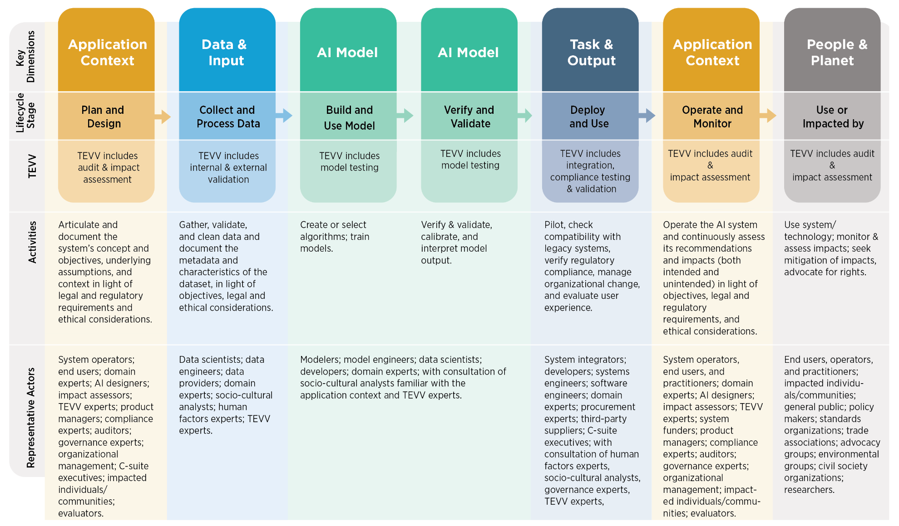

Version: 0.1
Author: https://github.com/yurkingw/AISecGuide
Date: 05/30/2026

---

# Enterprise AI Security Guidance

## 1. Introduction and Purpose

This Guidance establishes a structured, technology-neutral, and auditable approach for organizations to use artificial intelligence safely and securely in enterprise environments. It is intended for organizations that design, build, procure, integrate, deploy, operate, monitor, or retire AI-enabled systems, including systems based on large language models, retrieval-augmented generation, machine learning, and agentic workflows. The subject of this Guidance is not AI in the abstract; it is the secure organizational use of AI under real operational, legal, commercial, and governance constraints.

While there are many mature standards for traditional software and information systems, AI systems introduce risk characteristics that are not fully addressed by conventional software security, privacy, or operational risk approaches alone. AI systems may depend on training data, fine-tuning data, retrieval corpora, and live context that change over time, sometimes materially and unexpectedly. They may also exhibit behavior that is difficult to predict, explain, reproduce, or test exhaustively, especially when deployed as part of larger socio-technical workflows.

AI systems are inherently socio-technical. Their risks and benefits arise not only from model internals or code quality, but also from the interaction between technical design, human behavior, organizational process, external actors, market incentives, and the social setting in which the system is deployed. As a result, the same model can present meaningfully different risk depending on who uses it, what authority it has, what downstream systems trust its outputs, and what institutional controls surround it.

AI risk, AI safety, AI security, and cyber risk are related but not identical concepts. AI risk is the broadest category and includes operational, legal, ethical, market, safety, security, and systemic concerns. AI safety focuses on preventing harmful behavior, failures, and unsafe outcomes, especially where model behavior can create real-world damage. AI security focuses on protecting AI systems, the systems around them, and the organizations that depend on them against misuse, manipulation, compromise, unauthorized disclosure, and loss of control. Cyber risk remains relevant because AI systems are built on software, infrastructure, identities, data flows, and supply chains that remain subject to conventional attacks even when the model itself is not the primary point of failure.

This Guidance does not attempt to replace sector-specific law, safety engineering, privacy law, model governance policy, or software security standards. Instead, it provides a common enterprise control language that allows boards, executives, security leaders, risk owners, engineers, and auditors to reason about AI security in a consistent manner. It is designed to support internal policy writing, use-case reviews, architecture approvals, procurement due diligence, independent assurance, incident response, and control testing.

The controls described in this Guidance are not mandatory in all circumstances; their implementation should be determined on the basis of approved risk assessment results. In this document, `shall` is used in two ways. First, it denotes universal governance requirements for in-scope AI use cases, such as ownership assignment, use-case classification, impact grading, applicability determination, exception handling, and evidence retention. Second, it denotes a baseline requirement once the organization has determined that the control is applicable to the use case. Where a control is not applied, the basis should be supported by documented risk assessment and exception handling where relevant.

This Guidance is written for large enterprises in general, with an additional overlay for large financial institutions. The base requirements are framed so they can apply to organizations using externally hosted APIs, self-hosted models, traditional machine learning systems, retrieval-based applications, agentic systems, and hybrid architectures. The financial overlay strengthens requirements where the combination of customer impact, regulatory scrutiny, market sensitivity, concentration risk, and operational dependence creates elevated risk.

### 1.1 Characteristics of Trustworthy AI

This Guidance adopts the view that trustworthy AI should exhibit, to a degree appropriate for its impact and context, the following characteristics: `valid and reliable`, `safe`, `secure and resilient`, `accountable and transparent`, `explainable and interpretable`, `privacy-enhanced`, and `fair with harmful bias managed`. These characteristics should not be treated as abstract aspirations. They should be translated into design requirements, approval criteria, operational controls, assurance evidence, and change thresholds.

Valid and reliable performance is the necessary base for all other characteristics, but it is not sufficient on its own. A system can be accurate on benchmark tasks and still be unsafe in deployment, insecure under attack, opaque in decision effect, or harmful when embedded in a sensitive human workflow.

### 1.2 Non-Objectives

This Guidance does not provide product recommendations, legal advice, or a jurisdiction-specific regulatory interpretation. It does not define one mandatory architecture for AI systems. It does not assume that any single vendor, model family, or security tool can eliminate AI risk. It does not treat prompt filtering, model alignment, or content moderation as sufficient substitutes for organizational controls, downstream authorization, or operational oversight.

### 1.3 Intended Outcomes

Organizations implementing this Guidance should be able to classify AI use cases consistently, define ownership clearly, protect sensitive data and system behavior, constrain model and agent actions, verify high-risk outputs, monitor for harmful change, and demonstrate that AI-related risk decisions are deliberate, evidence-based, and reviewable.

### 1.4 Normative Interpretation and Applicability

For operational use, organizations should read this Guidance through three requirement classes. First, `universal governance requirements` apply to all in-scope AI use cases and include inventory, ownership, classification, impact grading, applicability determination, exception handling, and evidence retention. Second, `applicable control requirements` apply when triggered by the architecture, data sensitivity, authority level, operating context, or sector overlay of the use case. Third, `strengthened requirements` apply where the use case is high-impact, critical-impact, materially consequential, or otherwise subject to elevated legal, prudential, customer, or market sensitivity.

Organizations should therefore avoid two opposite mistakes: treating every `shall` statement as automatically mandatory for every use case, or treating domain-level `shall` statements as optional suggestions with no traceable applicability decision. The expected outcome is explicit applicability logic, explicit exception logic, and explicit evidence for both.

## 2. Scope Framework and Classification

Organizations shall define AI security scope using a set of complementary views rather than a single model-centric lens. The purpose of this chapter is to prevent narrow or misleading scoping in which attention is limited to the model while lifecycle stages, data sources, verification work, surrounding systems, human workflows, affected people, and cybersecurity interactions remain uncontrolled.

This Guidance adopts four complementary framing views for scope definition. First, AI should be viewed as a socio-technical system that spans application context, data, model development and use, verification and validation, deployment, operations, and the people or communities who use or are affected by it. Second, AI security should be viewed through the interaction between AI and cybersecurity, including securing AI systems, using AI to defend, and building resilience against AI-enabled threats. Third, AI risk should also be viewed through an adversary-lifecycle lens so that deliberate attack paths against models, data, agents, tools, and surrounding systems are not hidden inside generic control language. Fourth, common LLM and agentic failure modes should be viewed through a defender-oriented prioritization lens so that design, runtime, and response controls can be ordered pragmatically.

### 2.1 AI Lifecycle and Socio-Technical System View

The AI lifecycle view reflects that AI security scope extends across key dimensions such as `Application Context`, `Data and Input`, `AI Model`, `Task and Output`, and `People and Planet`, and across lifecycle stages such as planning, data processing, model building, verification and validation, deployment, operation, and real-world impact. It also makes clear that TEVV, operational activities, and representative actors exist across the full chain rather than in one isolated engineering step.

This view should not be reduced to a conventional software development lifecycle. In enterprise AI systems, behavior is shaped not only by code, but also by training and reference data, prompts, retrieval context, memory state, tool configuration, user interaction, and operating environment. As a result, materially different risk profiles can emerge even where the same underlying model is reused across different use cases or deployment contexts.

This view is important because many AI failures originate outside the model itself: in weak problem framing, poor data collection, insufficient validation, unsafe deployment assumptions, inadequate monitoring, or harms experienced by downstream users and affected communities.

It also reflects the socio-technical nature of AI. Control failure often arises from the interaction of model output, human judgment, workflow design, delegated authority, and business incentives rather than from a single technical defect. For that reason, AI security review should consider how people interpret outputs, when they are likely to over-trust them, how approvals are granted, and how operational feedback changes system behavior over time.

### 2.2 Cybersecurity and AI Interaction View

The cybersecurity-and-AI interaction view reflects that AI security is not limited to protecting models from attack. It includes `Secure`, meaning managing cybersecurity challenges for AI systems; `Defend`, meaning using AI to improve cyber defense; and `Thwart`, meaning building resilience against AI-enabled threats. The overlaps between these three areas capture AI-related cybersecurity opportunities and risks such as more effective protections, threat-informed security, and AI-enhanced operations.

This view matters because AI is both a protected asset and a force multiplier. The organization must protect AI systems and their surrounding stack from compromise, while also recognizing that AI can increase the speed, scale, adaptability, and deceptive quality of attacks against other systems, users, and business processes.

It also clarifies that the relevant attack surface is broader than the model itself. Enterprise AI security must account for identities, data flows, prompts, retrieval paths, tools, connectors, execution environments, external services, and output-consumption paths. Treating the model as the sole control focus will leave material exposure in the surrounding system.

This view is especially relevant for enterprises because AI can simultaneously be an attack surface, a defensive capability, and a multiplier of adversary speed, scale, and deception quality.

For the purposes of this Guidance, `Secure` is primarily expressed through design-time and architecture controls, `Defend` through operational use of AI to strengthen security functions, and `Thwart` through runtime containment, detection, response, and recovery against AI-enabled abuse. Chapters 3-9 should be read together as the main domain-level expression of those three security aims, with Chapters 5-9 providing the strongest technical and operational emphasis.

### 2.3 MITRE ATLAS Adversary Lifecycle View

The MITRE ATLAS view adds an adversary-behavior and adversary-lifecycle lens that complements the AI lifecycle and cybersecurity interaction views above. For enterprise AI security, this matters because many failures are not only engineering defects or governance gaps; they are also deliberate sequences of reconnaissance, access, manipulation, evasion, and impact carried out against models, data, tools, agents, and surrounding business processes.

The current official MITRE ATLAS matrix includes `16` tactics, `170` techniques, and `35` mitigations. The tactics below should be treated as a threat-informed overlay for enterprise scoping, threat modeling, red teaming, control validation, and incident response design.

A single technique may map to more than one tactic. Organizations should therefore use the tactic view as an adversary-lifecycle organizer rather than as a mutually exclusive classification scheme.

| Tactic ID | Tactic Name | Enterprise Security Meaning |
|---|---|---|
| AML.TA0002 | Reconnaissance | Adversary information gathering and target understanding relevant to AI systems. |
| AML.TA0003 | Resource Development | Preparation of capabilities, infrastructure, tools, and artifacts for later AI attack operations. |
| AML.TA0004 | Initial Access | Obtaining an initial foothold into an AI environment, workflow, or connected business process. |
| AML.TA0000 | AI Model Access | Gaining access to the model, model interface, or model-adjacent interaction path. |
| AML.TA0005 | Execution | Executing code, prompts, inputs, or manipulations that drive AI system behavior. |
| AML.TA0006 | Persistence | Maintaining ongoing presence or durable influence over AI assets, states, or workflows. |
| AML.TA0012 | Privilege Escalation | Increasing privilege or control within the AI stack or connected systems. |
| AML.TA0007 | Defense Evasion | Avoiding safeguards, monitoring, policy checks, or detection logic around AI systems. |
| AML.TA0013 | Credential Access | Accessing credentials, secrets, or tokens that expose AI systems or adjacent environments. |
| AML.TA0008 | Discovery | Learning about runtime state, model behavior, policies, assets, and reachable pathways. |
| AML.TA0015 | Lateral Movement | Moving from one foothold to another across connected AI or enterprise components. |
| AML.TA0009 | Collection | Collecting data, artifacts, or outputs of value from AI systems or adjacent workflows. |
| AML.TA0001 | AI Attack Staging | Preparing or shaping attack inputs, artifacts, or sequences specifically for AI exploitation. |
| AML.TA0014 | Command and Control | Maintaining remote influence, control, or signaling across an AI-enabled intrusion chain. |
| AML.TA0010 | Exfiltration | Removing sensitive outputs, models, data, or other valuable artifacts from the environment. |
| AML.TA0011 | Impact | Causing operational, security, safety, financial, or trust-related harm through AI compromise or abuse. |

This lifecycle lens does not replace the abstract risk-pattern library in this Guidance. Instead, it provides a more concrete adversary view that helps organizations translate generic risk statements into attack hypotheses, detection ideas, test scenarios, and evidence expectations. A selected priority technique and mitigation reference is provided in Appendix E.

### 2.4 OWASP LLM and Agentic Defense View

The OWASP Top 10 for LLM Applications 2025 and the OWASP Top 10 for Agentic Applications 2026 add a builder-and-defender-oriented view that complements the AI lifecycle, cybersecurity interaction, and adversary-lifecycle perspectives above. Unlike a broad enterprise taxonomy or an attack-technique matrix, these two OWASP documents prioritize the most operationally significant failure modes that application teams, platform teams, and defenders repeatedly encounter in real deployments, and they pair each entry with prevention and mitigation guidance.

For this Guidance, these OWASP documents should be used as defensive prioritization overlays. They help organizations convert abstract risk patterns into practical secure-by-design, secure-by-default, and secure-in-operation expectations. They are especially useful when designing runtime guardrails, approval paths, tool permissions, observability, test cases, and incident response coverage.

The LLM Top 10 emphasizes application-layer controls around prompts, data exposure, retrieval, outputs, supply chain, and resource use:

| OWASP LLM Entry | Defensive Focus | Enterprise Control Meaning |
|---|---|---|
| `LLM01:2025 Prompt Injection` | Prompt and context integrity | Treat all external and retrieved content as untrusted; separate instructions from data; validate high-risk tool or workflow effects before execution. |
| `LLM02:2025 Sensitive Information Disclosure` | Confidentiality and exposure control | Minimize sensitive data in prompts, context, memory, and outputs; apply retrieval scoping, secrets hygiene, and output filtering. |
| `LLM03:2025 Supply Chain` | Upstream dependency assurance | Assess providers, models, plug-ins, data sources, and libraries for provenance, integrity, change transparency, and exit risk. |
| `LLM04:2025 Data and Model Poisoning` | Integrity of training, tuning, and grounding inputs | Govern data lineage, curation, validation, rollback, and re-evaluation so poisoned artifacts cannot silently degrade behavior. |
| `LLM05:2025 Improper Output Handling` | Output trust boundary | Treat model output as untrusted until validated against structure, policy, business rules, and execution authority. |
| `LLM06:2025 Excessive Agency` | Bounded autonomy | Apply least privilege, least agency, and human approval to prevent the model from directly initiating unsafe actions. |
| `LLM07:2025 System Prompt Leakage` | Prompt confidentiality and design realism | Do not rely on prompts as a primary secret store; isolate true secrets and assume prompt text may eventually be exposed. |
| `LLM08:2025 Vector and Embedding Weaknesses` | Retrieval-path security | Secure the RAG pipeline with tenant isolation, index integrity, chunk provenance, query controls, and retrieval validation. |
| `LLM09:2025 Misinformation` | Harmful inaccuracy control | Use grounding, provenance, confidence handling, human review, and downstream guardrails for impactful outputs. |
| `LLM10:2025 Unbounded Consumption` | Resource, cost, and abuse governance | Apply quotas, rate limits, workload shaping, anomaly detection, and cost-aware controls to avoid exhaustion and financial abuse. |

The Agentic Top 10 extends this defensive view into multi-step systems that plan, invoke tools, store memory, communicate with other agents, and act on behalf of users. Its guidance places particular emphasis on `least-agency`, strong observability, non-human identity governance, and containment of autonomous failure propagation.

| OWASP Agentic Entry | Defensive Focus | Enterprise Control Meaning |
|---|---|---|
| `ASI01 Agent Goal Hijack` | Goal integrity | Constrain how goals are set, inherited, or changed; require trusted policy mediation and escalation for high-impact objective shifts. |
| `ASI02 Tool Misuse and Exploitation` | Tool invocation safety | Allowlist tools, validate arguments, restrict side effects, and bind tool use to explicit authority and context checks. |
| `ASI03 Identity and Privilege Abuse` | Non-human identity governance | Treat agent identities, tokens, sessions, and delegated privileges as first-class security subjects with least privilege and revocation controls. |
| `ASI04 Agentic Supply Chain Vulnerabilities` | Trust in agent dependencies | Govern prompts, models, workflows, MCP servers, tool definitions, connectors, and orchestration dependencies as a supply chain, not as static code only. |
| `ASI05 Unexpected Code Execution (RCE)` | Execution isolation | Sandbox code execution, remove ambient trust, restrict file/system/network access, and keep execution authority outside the model’s implicit control. |
| `ASI06 Memory & Context Poisoning` | Durable context integrity | Control memory writes, trust tiers, retention, provenance, and review of long-lived context so poisoned state cannot silently steer future actions. |
| `ASI07 Insecure Inter-Agent Communication` | Agent-to-agent trust boundary | Authenticate channels, validate message schema and provenance, and prevent agents from implicitly trusting peer instructions or artifacts. |
| `ASI08 Cascading Failures` | Blast-radius containment | Segment agents and workflows, add circuit breakers, rate limits, rollback paths, and safe degradation to stop localized failures from propagating system-wide. |
| `ASI09 Human-Agent Trust Exploitation` | Trust calibration and approval hygiene | Design interfaces and workflows so users understand what the agent knows, assumes, and intends to do before they approve or rely on it. |
| `ASI10 Rogue Agents` | Autonomous deviation detection and containment | Monitor agent behavior for divergence, add kill switches and revocation paths, and ensure autonomous loops can be interrupted and investigated. |

This OWASP defensive view does not replace either the ATLAS adversary-lifecycle view or the abstract risk-pattern library. Instead, it helps organizations answer a different question: given what is already known about common LLM and agentic failures, what should teams build, restrict, monitor, approve, and test first.

### 2.5 Enterprise Scoping and Control Boundary Overlay

The organization should operationalize the four framing views above through a practical enterprise scoping and control-boundary overlay. In this Guidance, that overlay is expressed through five scope layers that help translate a broad socio-technical, cyber-aware, adversary-aware, and defender-aware understanding of AI into concrete control boundaries.

This overlay is not a fifth independent framework. It is a translation layer that converts the four framing views above into enterprise governance, architecture, operations, and assurance decisions. Its purpose is to ensure that the same AI capability is not reviewed only as a model, only as an application, or only as a procurement item when, in practice, it spans multiple responsibilities and control boundaries at once.

An overlay is necessary because a single AI use case often crosses lifecycle boundaries, adversary exposure boundaries, application or agent failure boundaries, and organizational accountability boundaries at the same time. If those boundaries are not made explicit, control responsibilities are commonly assigned by component ownership alone, which can leave material gaps in approval, monitoring, testing, or incident response.

The five scope layers below should be used as an operational scoping method. Organizations should use them to determine who is accountable, which controls apply, which use cases require escalation, and where stronger observability, tighter runtime authority, or financial-sector overlay requirements become necessary. Incorrect boundary setting should itself be treated as a source of AI security risk.

#### 2.5.1 Organizational and Responsibility Layer

The organization shall identify the parties that decide, approve, build, operate, monitor, and retire AI use cases. At a minimum, this includes executive accountability, business ownership, technical ownership, security ownership, risk acceptance authority, procurement authority, legal or compliance review, and independent assurance. Where one party performs multiple roles, the organization shall still define the role boundaries and escalation paths.

#### 2.5.2 Lifecycle Layer

The scope shall cover acquisition or procurement, design, development, testing, deployment, operation, change management, incident handling, decommissioning, and retirement. Organizations shall not limit review to deployment-time controls; many AI security failures originate from unsafe acquisition, poor data handling, undocumented change, or uncontrolled post-deployment learning and configuration drift.

#### 2.5.3 System Stack Layer

The scope shall include environment, identities, platform services, models, data pipelines, training and fine-tuning assets, knowledge bases, vector stores, prompts and policies, tools and plugins, agent orchestration, user interfaces, external APIs, and logging and monitoring systems. For self-hosted AI environments, the scope shall also explicitly include GPU clusters, high-speed fabrics, DPUs or SmartNICs, storage fabrics, scheduler and cluster control planes, and out-of-band management paths. Security assumptions made at one layer shall not be treated as valid for all other layers.

#### 2.5.4 Usage Mode Layer

Organizations shall distinguish among informational assistance, content generation, analysis support, business decision support, customer interaction, workflow automation, and semi-autonomous or autonomous action. A system with the same model and the same data may carry materially different risk depending on whether it only drafts text, influences decisions, or can directly trigger actions in downstream systems.

#### 2.5.5 Impact Grading Layer

Organizations shall grade AI use cases according to the potential impact on confidentiality, integrity, availability, legal and regulatory exposure, customer rights and outcomes, operational continuity, financial loss, market effects, and reputational stability. High-impact and critical-impact use cases shall be subject to stronger admission controls, stronger evidence requirements, stricter change management, and more conservative runtime authority.

### 2.6 How AI Risks Differ from Traditional Software Risks

Compared with traditional software, AI systems introduce new or materially amplified risks that shall be considered in scoping, review, and control design. These differences do not eliminate the relevance of traditional cybersecurity, privacy, software assurance, or operational resilience practices. Instead, they mean those practices must be extended with AI-specific analysis, evidence, and controls.

Organizations should account for at least the following AI-specific or AI-amplified differences:

The table below is intentionally concise. Its purpose is not to restate all source material, but to show why familiar software controls are insufficient on their own and what additional control implication each AI-specific difference creates.

| AI-specific risk difference | Description | Primary control implication |
|---|---|---|
| `1. Data-context mismatch` | The data used to build or tune an AI system may not match the real conditions in which the system will be used, and reliable ground truth may be incomplete, disputed, or unavailable. | Use-case-specific data review, contextual validation, bias review, and stronger admission control for high-impact uses. |
| `2. Data dependence at scale` | AI systems depend on large, complex, and continuously changing data not only for training and evaluation, but often also for runtime retrieval and grounding. | Stronger data lineage, provenance, minimization, segmentation, and retrieval governance. |
| `3. Training sensitivity and behavioral shift` | Small or poorly understood changes in fine-tuning data, prompts, retrieval settings, or system configuration can cause material changes in behavior. | Treat tuning, prompt, and retrieval changes as material changes subject to change control and revalidation. |
| `4. Context decay and staleness` | Data or evaluation sets that were once appropriate may gradually become outdated, lose their original meaning, or stop reflecting current production conditions. | Require freshness review, re-grounding, dataset retirement criteria, and deployment-context reevaluation. |
| `5. Scale, opacity, and emergent complexity` | Large models can behave in ways that are difficult to fully explain, reproduce, or predict, especially when compared with deterministic code paths in traditional software. | Use layered controls, bounded authority, runtime monitoring, and evidence-based assurance instead of assuming full predictability. |
| `6. Pre-trained model uncertainty` | Reusing pre-trained models can improve speed and performance, but it can also leave uncertainty about provenance, bias, reproducibility, scientific validity, and whether the model is being used outside its intended context. | Strengthen supplier diligence, provenance review, intended-use constraints, and independent validation before material deployment. |
| `7. Privacy amplification` | AI systems may infer, reconstruct, combine, or restate sensitive information in ways that create privacy harm even when raw records are not directly exposed. | Apply minimization, purpose limitation, output controls, memory controls, and privacy-enhancing design. |
| `8. Frequent revalidation need` | AI behavior can change more often than conventional software because data, concepts, suppliers, retrieval sources, and operating context all shift over time. | Adopt event-driven revalidation, drift monitoring, rollback readiness, and explicit review triggers. |
| `9. Testing and documentation gaps` | For many AI systems, especially complex or generative ones, testing methods, documentation standards, and evidence expectations are still less mature than they are for conventional software. | Compensate with scenario testing, adversarial evaluation, safety cases, structured documentation, and retained evidence. |
| `10. Attack surface expansion` | AI systems introduce or amplify risks that are not fully covered by older software or cybersecurity frameworks, including prompt injection, model extraction, evasion, misuse, and AI-enabled abuse of connected systems. | Expand threat modeling, abuse-case testing, boundary validation, and downstream authorization controls. |
| `11. Third-party and off-label dependence` | Organizations may rely on external models or systems that were trained, tuned, or operated outside their own control environment and possibly for a different original purpose. | Impose third-party risk management, off-label use review, exit planning, and contractual transparency expectations. |
| `12. Environmental and side-effect uncertainty` | AI systems can create operational, environmental, or systemic side effects, such as high compute demand or hard-to-anticipate downstream consequences, that are not visible from narrow performance metrics alone. | Include broader impact review, operating envelope limits, resilience planning, and non-performance risk assessment. |

Organizations should therefore treat AI security and AI risk management as an extension of enterprise risk management, while also leveraging established security and privacy frameworks such as the NIST Cybersecurity Framework, NIST Privacy Framework, NIST Risk Management Framework, and Secure Software Development Framework where they remain applicable.

### 2.7 Foundation Risk Pattern Library

This Guidance uses abstract risk patterns rather than vulnerability lists as its main classification method. Risk patterns are recurring modes by which harm, compromise, or loss of control can emerge across different models, architectures, and business processes.

The organization shall use at least the following risk pattern library:

This library is intentionally abstract. Organizations may maintain more detailed threat, misuse, or scenario taxonomies underneath it, but those detailed lists should map back to this common library so that governance, assurance, and audit language remain stable across changing model types and attack techniques.

### 2.8 Common Control Objective Library

The organization shall use the following control objective library throughout AI security design and assurance activities:

This control objective library is not intended to map one-to-one to the risk pattern library. Instead, it provides a reusable set of abstract control families that may map to multiple risk patterns, and each risk pattern may require multiple control objectives in response.

These control objectives are intended to remain solution-agnostic. Organizations may implement them using different architectural patterns, operating models, or vendor products, but each implementation should still be demonstrably traceable to one or more control objectives in this library.

## 3. Governance, Accountability, and Risk Acceptance

### 3.1 Purpose

The purpose of this domain is to ensure that AI security is governed as an enterprise risk issue rather than delegated solely to engineering teams or model providers. Organizations should treat AI security outcomes as management responsibilities because many of the highest-impact failures arise from unclear ownership, uncontrolled exception handling, weak challenge processes, or pressure to deploy without adequate evidence.

### 3.2 Scope

This domain applies to governance structures, security management, approval forums, risk committees, model governance bodies, procurement decisions, policy exceptions, issue management, and retirement decisions for AI-enabled systems.

### 3.3 Problem Context

AI systems routinely cross functional boundaries. Business teams may sponsor them, technology teams may integrate them, security teams may review them, procurement teams may contract them, and external providers may materially shape their behavior. Without explicit governance, failures fall between functions. In practice, organizations often know who built a use case but not who can stop it, constrain it, downgrade it, or accept its residual risk.

### 3.4 Common Solution Patterns

Organizations commonly address this domain by establishing an AI governance forum, embedding AI into existing model-risk and cyber governance, applying impact-based tiered approval, defining explicit exception handling, and assigning clear authority over non-human identities and delegated permissions. The preferred pattern is not a separate bureaucracy for every use case, but a tiered governance model in which low-impact uses move quickly while high-impact, customer-affecting, or action-taking uses face stronger challenge, evidence, approval, and revocation thresholds.

### 3.5 Risk Patterns

The primary risk patterns in this domain are `Insufficient Monitoring, Traceability, and Accountability`, `Uncontrolled Change, Drift, and Degradation`, `Concentration and Single-Dependency Risk`, `Misuse, Fraud, and Deceptive Operation`, and `Human Trust Exploitation, Overreliance, and Authority Distortion`. Additional risk patterns include `Trust Boundary Violation` and `Privilege Amplification and Unauthorized Action` where governance assumptions about people, vendors, identities, review gates, or runtime authority do not match actual system behavior.

### 3.6 Control Objectives

Organizations shall establish the following governance controls:

   The organization shall assign accountable owners for each material AI use case, including business ownership, technical ownership, security ownership, and formal risk acceptance authority.

   AI use cases shall be classified before deployment and reclassified when capabilities, data, user populations, or downstream actions materially change.

   Material model, data, prompt, retrieval, tool, or vendor changes shall trigger review and revalidation proportional to impact.

   The organization shall identify where critical capabilities depend on single providers, single models, single clouds, or opaque upstream suppliers.

   The organization shall define who may create, approve, issue, rotate, revoke, and monitor non-human identities, delegated permissions, agent credentials, and privileged tool authorities used by AI-enabled systems.

### 3.7 Implementation Principles

1. AI security should be embedded in existing enterprise governance where possible rather than isolated into an unaccountable innovation channel.

2. Residual risk acceptance should be explicit, documented, time-bounded, and reviewable.

3. Residual risk for customer-affecting, market-affecting, legally sensitive, or action-taking use cases should not be accepted solely by the delivery team.

4. High-impact use cases should require independent challenge from security, risk, compliance, or audit functions.

5. Material exceptions should define scope, compensating controls, expiry, review triggers, and revocation conditions before approval.

6. Emergency exceptions may exist, but they should be narrow, time-bounded, and subject to post-implementation review; they should not become the normal route to production.

7. Approval workflows should be designed to reduce automation bias, rubber-stamping, and false confidence created by authoritative-looking AI outputs or interfaces.

### 3.8 Evidence and Assurance

Relevant evidence includes AI use-case inventories, impact classifications, approval records, risk acceptance records, exception logs, change records, retirement procedures, vendor dependency assessments, identity and delegation approval records, meeting minutes, and issue escalation trails.

### 3.9 Key Failure Modes

Common failure modes include shadow AI deployment, high-impact customer use without governance review, risk acceptance by teams without authority, undocumented changes to prompts, retrieval logic, tools, or delegated permissions, and inability to identify who approved a risky AI capability, why it was approved, and when that approval expires.

### 3.10 Threat-Informed Deep Dive

Governance controls should explicitly define how threat intelligence becomes policy, approval thresholds, and authority. MITRE ATLAS and OWASP content should not remain only in reference material; they should influence use-case admission, residual-risk decisions, red-team scope, supplier review, identity approval boundaries, and incident escalation thresholds. For example, ATLAS tactics such as `Reconnaissance`, `Initial Access`, `Persistence`, `Defense Evasion`, `Credential Access`, and `Impact` should be used to test whether a high-impact AI system can be discovered, entered, manipulated, hidden, credential-abused, and exploited in ways that governance would otherwise miss.

The central governance question is not whether a control exists on paper, but who can stop, constrain, revoke, or downgrade the system when evidence deteriorates or a threat-informed test fails. OWASP LLM and Agentic entries should therefore be translated into explicit policy decisions, including which uses require human approval, which agent actions are prohibited, which outputs require dual review, which prompts, tools, identities, or connectors count as material changes, and which failure modes trigger executive notification.

### 3.11 Coverage Mapping

| Coverage area | Covered guidance elements |
|---|---|
| `Chapter 2 views` | Lifecycle governance, Cyber AI accountability, ATLAS threat-informed governance, OWASP defensive prioritization. |
| `Primary risk patterns` | `Insufficient Monitoring, Traceability, and Accountability`; `Uncontrolled Change, Drift, and Degradation`; `Concentration and Single-Dependency Risk`; `Misuse, Fraud, and Deceptive Operation`; `Human Trust Exploitation, Overreliance, and Authority Distortion`. |
| `Primary control objectives` | `Governance and Ownership`; `Use-Case Classification and Admission Control`; `Change Control and Revalidation`; `Third-Party and Concentration Risk Management`; `Identity, Credential, and Delegation Governance`. |
| `Evidence emphasis` | Use-case inventory, risk acceptance authority, exception records, red-team approval scope, identity and delegation approval records, policy-to-control traceability. |

### 3.12 Reference Alignment

This chapter aligns primarily to NIST AI RMF `GOVERN`, ISO/IEC 42001, ISO/IEC 23894, the OWASP Agentic emphasis on human approval and least agency, and financial-sector expectations in FSB 2024 and Bank of England 2025 regarding material-risk governance, concentration visibility, and senior-management accountability.

### 3.13 Related Scenario Profiles

This governance domain is operationalized further in `Appendix B`, especially for external customer chat and service, privileged tool-using agents, workflow automation agents, coding assistants and development agents, and high-impact decision support where approval authority, residual-risk ownership, and change governance must be explicit.

### 3.14 Threat-Informed Governance Mapping

| Threat-informed concern | Why it belongs in governance | Governance emphasis |
|---|---|---|
| `OWASP LLM06 Excessive Agency` | Over-broad authority is often approved as a design convenience rather than justified as a risk-based necessity. | Admission criteria, least-agency policy, approval thresholds for action-taking use cases, and periodic authority review. |
| `OWASP ASI03 Identity and Privilege Abuse` | Weak non-human identity governance creates approval gaps even when technical controls exist elsewhere. | Explicit ownership for non-human identities, delegated-authority approval, revocation authority, and reviewable credential lifecycle records. |
| `OWASP ASI09 Human-Agent Trust Exploitation` | Human approval can become ceremonial if interfaces, workflows, or incentives encourage over-trust. | Approval-quality standards, dual review for material outputs, operator training, and governance metrics for automation bias or rubber-stamping. |
| `MITRE ATLAS Credential Access` | Credential compromise becomes a governance issue when no owner can suspend delegated access quickly. | Defined authority for credential suspension, incident escalation thresholds, and role clarity across security, engineering, and business owners. |
| `MITRE ATLAS Persistence and Defense Evasion` | If governance does not treat threat-informed test failure as a formal review trigger, unsafe systems can remain in production by inertia. | Mandatory escalation triggers, expiry on temporary approvals, and documented stop or downgrade authority. |

## 4. Data, Privacy, and Knowledge Security

### 4.1 Purpose

The purpose of this domain is to protect sensitive data, maintain appropriate data boundaries, prevent unintended disclosure, and control how knowledge sources are ingested, stored, retrieved, and exposed by AI-enabled systems.

### 4.2 Scope

This domain applies to prompts, training data, fine-tuning data, evaluation data, RAG corpora, vector stores, memory systems, logs, outputs, metadata, and the identity and authorization rules that control their use.

### 4.3 Problem Context

AI systems can expose data in ways that differ from conventional applications. Sensitive content may be revealed directly through outputs, indirectly through summarization, recovered through prompt engineering, leaked through logs or analytics, or reintroduced through retrieval and agent memory. Data that was never intended for externalization may become inferable once it is indexed, embedded, mixed into prompts, or included in downstream tooling.

For control design, this domain should be understood across three distinct boundary layers. First, `source-data access` determines what underlying records, repositories, and systems may be reached. Second, `retrieval and memory use` determines what information may be brought into model context, retained, or re-used across interactions. Third, `output and logging exposure` determines what information may be shown, exported, stored, or made available for later analytics, investigation, or automation. A control weakness at any one layer can defeat stronger controls at the others.

### 4.4 Common Solution Patterns

Common patterns include retrieval-based grounding on approved knowledge, data minimization, purpose-bound access approval, data segmentation by sensitivity and purpose, access control at the source system, pre-ingestion sanitization, retrieval scoping, memory-write restriction, output filtering, and logging controls for high-sensitivity uses. No single pattern is sufficient on its own; data protection depends on combined controls at source, retrieval, prompt construction, output validation, memory retention, and logging.

### 4.5 Risk Patterns

The primary risk patterns in this domain are `Sensitive Information Exposure`, `Trust Boundary Violation`, `Manipulation of Model or Context`, `Output-Driven Downstream Harm`, and `Supply Chain and Provenance Opacity`. Additional risk patterns may arise where weak identity, retrieval, or memory controls allow protected data to be reached, retained, or re-exposed beyond intended use.

### 4.6 Control Objectives

   Organizations shall limit AI system access to the minimum data necessary for the intended task and shall not expose data classes to models, agents, or retrieval systems unless a legitimate and documented need exists.

   Data approval shall be purpose-specific. Approval to access a data class for retrieval or question answering shall not by itself authorize use of the same data for training, fine-tuning, evaluation, long-term memory, analytics, or downstream automation.

   Sensitive knowledge sources, customer information, regulated records, and internal policies shall be segmented according to sensitivity, access population, and business purpose.

   The organization shall define how retrieval identities, service accounts, delegated data-access permissions, and memory-write authorities are approved, scoped, rotated, and revoked.

   The organization shall understand where data originated, how it was transformed, and whether it is suitable for inclusion in AI workflows.

   This suitability review shall cover both sensitivity and permitted use. Data that is acceptable for human reference, internal search, or narrow decision support may still be unsuitable for broad indexing, agent memory, model adaptation, or external-model exposure.

   AI-related logging shall support investigation without itself becoming an uncontrolled repository of sensitive prompts, outputs, or customer information.

### 4.7 Implementation Principles

1. Authorization should be enforced at the underlying data system, not delegated solely to the model.

2. Retrieval and memory should be sensitivity-aware and population-aware.

3. Long-lived memory writes should be subject to stricter trust and authorization criteria than ephemeral prompt context.

4. Long-lived memory should not be enabled by default for high-sensitivity or regulated use cases, and automatic memory writing should be restricted unless a documented business need and control design exist.

5. Logs should be deliberately designed rather than exhaustively collected.

6. Regulated or highly sensitive data should require stricter review before inclusion in fine-tuning, long-term memory, or broad retrieval indexes.

7. Customer identity data, transaction data, investigation materials, compliance records, internal control documentation, and market-sensitive information should be treated as requiring elevated review before AI reuse or broad exposure.

### 4.8 Evidence and Assurance

Relevant evidence includes data inventories, classification schemes, permitted-use rules, retrieval source approval records, access control mappings, identity and delegation approval records, sanitization rules, memory-retention and deletion rules, logging scopes, retention rules, prompt and output handling procedures, and tests for leakage and overexposure.

### 4.9 Key Failure Modes

Common failure modes include broad indexing of internal repositories without sensitivity filtering, reusing data for model adaptation or memory without specific approval, exposing customer or regulated data to external models by default, retaining sensitive prompts in analytics pipelines, granting broad delegated retrieval rights without review, and giving models indirect access to data that downstream systems would not otherwise permit.

### 4.10 Threat-Informed Deep Dive

Data, privacy, and knowledge controls should be designed against both accidental leakage and adversarial discovery. ATLAS tactics such as `Reconnaissance`, `Discovery`, `Collection`, `Exfiltration`, and `AI Attack Staging` are directly relevant because enterprise knowledge bases, vector indexes, logs, and memory stores can become both targets and stepping stones for later attacks. Controls should therefore cover not only access to source data but also how data is transformed into embeddings, summaries, citations, telemetry, and long-lived memory.

OWASP LLM and Agentic guidance sharpens this domain around `Sensitive Information Disclosure`, `Vector and Embedding Weaknesses`, and `Memory & Context Poisoning`. The practical implication is that retrieval authorization, corpus provenance, memory write controls, memory retention, delegated data access, and log retention must be treated as security controls, not as product or analytics decisions.

### 4.11 Coverage Mapping

| Coverage area | Covered guidance elements |
|---|---|
| `Chapter 2 views` | Lifecycle data governance; Cyber AI data protection; ATLAS discovery, collection, and exfiltration; OWASP disclosure, RAG, and memory controls. |
| `Primary risk patterns` | `Sensitive Information Exposure`; `Trust Boundary Violation`; `Manipulation of Model or Context`; `Output-Driven Downstream Harm`; `Supply Chain and Provenance Opacity`. |
| `Primary control objectives` | `Data Minimization and Confidentiality Protection`; `Least Privilege and Segmentation`; `Identity, Credential, and Delegation Governance`; `Provenance, Integrity, and Dependency Assurance`; `Logging, Evidence, and Investigability`. |
| `Evidence emphasis` | Data classification, permitted-use rules, retrieval authorization tests, corpus provenance, memory-write audit, delegated-access approval records, leakage tests, and log-retention design. |

### 4.12 Reference Alignment

This chapter aligns primarily to NIST AI RMF trustworthiness characteristics, ISO/IEC 23894, NIST IR 8596, OWASP LLM Top 10 2025 sensitive disclosure themes, and SAFE-AI concerns regarding embedded sensitive information and data handling.

### 4.13 Related Scenario Profiles

This domain is operationalized further in `Appendix B`, especially for internal knowledge assistants, external customer chat, RAG document Q&A, summarization and content generation, fraud support, compliance support, and high-impact decision support.

## 5. Model, Component, and Supply Chain Security

### 5.1 Purpose

The purpose of this domain is to manage the security and trust implications of models, datasets, libraries, orchestration components, external APIs, and other upstream dependencies that materially influence AI system behavior.

### 5.2 Scope

This domain applies to open-weight models, proprietary hosted models, machine learning frameworks, model serving stacks, prompt middleware, embeddings, vector databases, agent frameworks, pre-trained assets, CLI-based execution tools, agent skills, plugins, MCP servers and connectors, hooks, scripts, tool descriptors, execution brokers, and all upstream suppliers materially affecting AI behavior.

### 5.3 Problem Context

AI systems frequently depend on opaque upstream components that the organization did not create and cannot fully inspect. These may include model weights, training data, closed service APIs, retrieval libraries, evaluation toolkits, orchestration frameworks, and tool-integration mechanisms such as plugins, skills, CLI wrappers, MCP connectors, hooks, and scripts. Security and assurance therefore depend not only on internal engineering quality but on whether the organization understands what it is running, where it came from, how it can change, what authority it introduces, and what failure modes it creates.

For governance purposes, the supply chain in this chapter should be understood across at least four object classes. First, `model and data artifacts` include weights, datasets, adapters, prompts, and evaluation sets. Second, `runtime components and connectors` include plugins, skills, MCP servers, tool descriptors, hooks, scripts, and execution brokers. Third, `managed services and supplier behavior` include hosted APIs, model-routing logic, service-side policy changes, and runtime defaults controlled by providers. Fourth, `evaluation and governance artifacts` include benchmarks, safety policies, approval templates, and other control artifacts that shape whether a dependency is accepted or trusted.

### 5.4 Common Solution Patterns

Organizations commonly respond through due diligence, dependency inventories, controlled onboarding, isolated evaluation environments, integrity verification, contractual controls, staged deployment, runtime guardrails, continuous dependency monitoring, and periodic dependency re-assessment. The strongest pattern is not blind trust in reputation but disciplined provenance, integrity, change control, concentration awareness, and continuing assurance across the AI supply chain.

### 5.5 Risk Patterns

The primary risk patterns in this domain are `Supply Chain and Provenance Opacity`, `Manipulation of Model or Context`, `Uncontrolled Change, Drift, and Degradation`, `Concentration and Single-Dependency Risk`, and `Privilege Amplification and Unauthorized Action`. Additional risk patterns may arise where opaque dependencies, supplier defaults, or execution-extending components quietly alter authority or system behavior after onboarding.

### 5.6 Control Objectives

   Organizations shall maintain a current inventory of material AI dependencies and shall evaluate their origin, integrity, trust assumptions, and update behavior.

   New models, datasets, and agent frameworks shall be admitted through defined review criteria before production use.

   The organization shall identify dependencies whose failure, compromise, withdrawal, or terms changes would materially disrupt operations.

   Supplier-driven updates, model swaps, and dependency upgrades shall not be treated as low-risk maintenance by default.

   Untrusted or lightly understood models, connectors, tools, and orchestration components shall be introduced and evaluated in isolated environments before they are allowed to influence production systems.

   This requirement applies equally to plugins, skills, CLI wrappers, hooks, scripts, MCP integrations, and other execution-extending mechanisms when they can alter reachable systems, available tools, authority boundaries, or data flows.

   Material AI dependencies shall be subjected to independent testing, adversarial evaluation, or equivalent challenge mechanisms appropriate to their authority, opacity, and operational criticality before and after production onboarding.

### 5.7 Implementation Principles

1. Upstream opacity should increase, not decrease, internal assurance requirements.

2. External model reputation should not substitute for independent internal validation.

3. Isolation should be used for first contact with untrusted or lightly understood components.

4. Vendor contracts should support reviewability, incident cooperation, material change notice, and operational exit planning.

5. Supplier-issued credentials, connectors, or managed execution paths should not bypass internal approval, segmentation, or monitoring requirements.

6. Dependencies that extend execution, tool reach, or delegated authority should be treated as material changes even when introduced as developer convenience features or platform defaults.

### 5.8 Evidence and Assurance

Evidence includes dependency inventories, onboarding reviews, provenance records, integrity verification results, isolated evaluation records, architecture decision records, material change notices, tool-integration approval records, evaluation logs, and concentration risk assessments.

### 5.9 Key Failure Modes

Failure modes include deploying models with unclear provenance, accepting silent vendor model changes, relying on a single upstream provider for critical customer or control functions, evaluating new dependencies in over-privileged environments, and integrating plugins, skills, CLI tools, hooks, scripts, connectors, libraries, or frameworks that materially expand runtime authority without corresponding review.

### 5.10 Threat-Informed Deep Dive

This domain is where abstract supply-chain risk becomes concrete. ATLAS techniques around acquiring public AI artifacts, AI supply-chain compromise, unsafe AI artifacts, poisoned models, and manipulated AI components should be used to define supplier due diligence, intake testing, integrity verification, and runtime monitoring requirements. The relevant question is whether the organization can prove what it is running and can detect when that dependency changes in a security-relevant way.

OWASP LLM `Supply Chain` and `Data and Model Poisoning`, together with OWASP Agentic `Agentic Supply Chain Vulnerabilities`, extend the scope beyond model weights and libraries. Prompt templates, tool descriptors, MCP servers, orchestration policies, adapters, evaluation datasets, managed API behavior, supplier-issued runtime identities, and execution-extending mechanisms such as plugins, skills, CLI wrappers, hooks, and scripts should all be treated as material dependencies when they can shape system behavior.

For material financial workflows, external models, platforms, connectors, and execution extensions should not be treated as irreducible black boxes. The organization should retain enough visibility, validation evidence, incident cooperation rights, and substitution planning to justify continued use under customer, prudential, compliance, or market-sensitive conditions.

### 5.11 Coverage Mapping

| Coverage area | Covered guidance elements |
|---|---|
| `Chapter 2 views` | Lifecycle procurement and change; Cyber AI secure AI system focus; ATLAS resource development, initial access, persistence, and impact; OWASP supply chain and poisoning controls. |
| `Primary risk patterns` | `Supply Chain and Provenance Opacity`; `Manipulation of Model or Context`; `Uncontrolled Change, Drift, and Degradation`; `Concentration and Single-Dependency Risk`; `Privilege Amplification and Unauthorized Action`. |
| `Primary control objectives` | `Provenance, Integrity, and Dependency Assurance`; `Use-Case Classification and Admission Control`; `Third-Party and Concentration Risk Management`; `Change Control and Revalidation`; `Execution Isolation and Action Containment`; `Independent Testing and Adversarial Evaluation`. |
| `Evidence emphasis` | AI bill of materials, model/source approval, dependency inventory, supplier attestations, integrity checks, isolated onboarding, tool-integration approval records, staged deployment, and rollback evidence. |

### 5.12 Reference Alignment

This chapter aligns primarily to MITRE SAFE-AI, MITRE ATLAS, OWASP LLM Top 10 2025 supply chain and poisoning themes, NIST IR 8596, and FSB concerns regarding concentration and third-party dependency.

### 5.13 Related Scenario Profiles

This domain is operationalized further in `Appendix B`, especially for coding assistants and development agents, privileged tool-using agents, RAG document Q&A, and high-impact decision support built on third-party models or managed platforms.

### 5.14 OWASP Threat Profile Mapping

| OWASP entry | Why it belongs here | Primary control emphasis |
|---|---|---|
| `LLM03:2025 Supply Chain` | Covers compromised models, adapters, libraries, repositories, third-party APIs, hosted services, and policy changes in upstream providers. | Dependency inventory, provenance review, integrity verification, supplier diligence, staged onboarding, and exit planning. |
| `LLM04:2025 Data and Model Poisoning` | Covers poisoning of training data, fine-tuning inputs, evaluation sets, RAG corpora, and model behavior through upstream tampering. | Source trust controls, data curation, isolation, integrity monitoring, revalidation, and suspicious-change investigation. |
| `ASI04 Agentic Supply Chain Vulnerabilities` | Extends supply-chain risk to agent frameworks, MCP descriptors, orchestration artifacts, tool metadata, plugins, hooks, scripts, connectors, and non-human identities used by agents. | Signed artifact expectations, descriptor validation, tool-source trust, controlled extension onboarding, isolated evaluation, and continuous dependency review. |

## 6. Application, Prompt, Context, and Output Security

### 6.1 Purpose

The purpose of this domain is to secure the application layer in which inputs are accepted, context is assembled, prompts are constructed, models are invoked, outputs are rendered, and downstream systems are influenced. This domain is central because many enterprise AI incidents are not failures of the base model alone; they are failures of the application logic that trusted the wrong content, blended instructions incorrectly, or gave downstream effect to unverified output.

### 6.2 Scope

This domain applies to chat applications, RAG interfaces, document summarizers, copilots, knowledge assistants, code assistants, classification pipelines, multimodal interfaces, and any application that turns model outputs into user-visible or system-actionable results.

### 6.3 Problem Context

Enterprise AI applications often mix multiple content types and trust levels in one inference chain: system prompts, developer instructions, user inputs, retrieved documents, tool outputs, hidden metadata, and conversation history. If the application does not preserve clear control boundaries, untrusted content can alter behavior, unreviewed outputs can drive action, and sensitive context can leak. In agentic or retrieval-heavy systems, this problem becomes more severe because the model can interact with large corpora and multiple tools at speed.

For control purposes, this domain should be read across three layers. First, `input and context control` determines what the model is allowed to see and how instructions are separated from data. Second, `output and rendering control` determines what the application is allowed to present, execute, store, or transmit. Third, `user trust and interpretation control` determines how users understand what was generated, what was retrieved, what was verified, and what still requires human judgment.

Applications should not rely on the model as the final policy authority. Wherever a control decision can be made deterministically at the application boundary, in the retrieval layer, in the execution wrapper, or in the downstream system, it should be made there rather than delegated to model judgment.

### 6.4 Common Solution Patterns

Common patterns include prompt templates, policy layers, structured output constraints, retrieval filtering, source labeling, tool mediation, user-interface separation of trusted and untrusted content, trust-calibrated presentation, and pre-execution review for risky outputs. Organizations should combine these patterns rather than assume that any one measure can solve prompt injection, context confusion, unsafe output handling, or over-trust in persuasive content.

In more exposed or higher-risk applications, these patterns may be implemented through semantic validation and policy-enforcement layers that inspect prompt context, retrieved material, tool arguments, and output intent before the content is trusted or propagated. This Guidance does not mandate a specific product category, but this family of controls is often described in practice as an `AI semantic firewall`.

### 6.5 Risk Patterns

The primary risk patterns in this domain are `Trust Boundary Violation`, `Manipulation of Model or Context`, `Privilege Amplification and Unauthorized Action`, `Output-Driven Downstream Harm`, `Sensitive Information Exposure`, and `Human Trust Exploitation, Overreliance, and Authority Distortion`. Additional risk patterns may arise where retrieved content, generated rationale, or interface design compress uncertainty into false confidence or unsafe downstream action.

### 6.6 Control Objectives

   The application shall distinguish system instructions, developer policies, user requests, retrieved content, and tool-returned content, and shall prevent untrusted material from being treated as authoritative system control input.

   Only the minimum context required for the current task shall be exposed to the model, and hidden instructions or sensitive system details shall not be disclosed through normal response pathways.

   High-risk outputs that affect records, permissions, transactions, or customer-facing decisions shall require additional validation or human approval before they can produce material effect.

   Outputs that are materially persuasive, customer-facing, analyst-facing, or decision-influencing shall not be presented in a way that implies verification, authority, or certainty beyond the evidence actually available.

   The application shall retain sufficient evidence to reconstruct prompt context, retrieved sources, tool calls, and output handling decisions for investigation and review.

   The application shall be tested for prompt injection, context confusion, information leakage, unsafe output handling, and cross-boundary manipulation.

   High-risk application flows shall include runtime checks capable of pausing, blocking, escalating, or quarantining suspicious prompts, unsafe tool arguments, harmful output intent, or policy-defeating interaction patterns before material effect is produced.

   Applications that influence customer understanding, analyst judgment, approval decisions, or operational action shall present generated content, retrieved content, verified evidence, and unresolved uncertainty in a clearly differentiated manner.

### 6.7 Implementation Principles

1. Untrusted context should be treated as data, not as policy.

2. Model outputs should be treated as claims requiring interpretation, not as commands requiring obedience.

3. Downstream authorization should be enforced by controlled systems and not inferred from model confidence or formatting.

4. User interfaces should help users understand when content is generated, retrieved, quoted, or system-verified.

5. User interfaces should calibrate trust explicitly and should not present generated rationale, formatting, or fluency as evidence of correctness.

6. Customer-facing, analyst-facing, and approval-supporting interfaces should clearly distinguish verified sources, generated text, unverified claims, and required human judgment.

7. Multimodal inputs should be assumed capable of carrying control-relevant payloads even when they appear benign to humans.

8. Semantic boundary enforcement should be applied before trust is granted to retrieved content, tool-returned content, or model-generated content in high-risk flows.

9. Customer-facing, analyst-facing, and approval-supporting outputs should avoid unwarranted certainty cues, fabricated rationale, or presentation patterns that compress unresolved uncertainty into false confidence.

### 6.8 Evidence and Assurance

Evidence includes prompt and policy architecture, retrieval source rules, output validation logic, runtime guardrail rules, tool mediation controls, UI labels and disclosure logic, customer-facing or analyst-facing presentation rules, red-team results, leakage tests, audit logs, and records of human approvals or dual review for high-risk actions.

### 6.9 Key Failure Modes

Failure modes include direct and indirect prompt injection, hidden instructions embedded in retrieved documents or multimodal content, system prompt leakage, unsafe rendering of model outputs, model outputs triggering downstream execution without validation, and user over-reliance or confusion about what the system has actually verified.

### 6.10 Threat-Informed Deep Dive

Application-layer AI security should assume that natural language, documents, websites, images, code snippets, and tool outputs can all carry adversarial instructions. ATLAS techniques around prompt injection, prompt infiltration, delayed instruction execution, AI model evasion, and exfiltration via AI services are directly relevant to this domain. The defensive design goal is to keep instructions, data, retrieved context, generated output, and executable effects in separate trust zones.

OWASP LLM guidance is especially central here: prompt injection, sensitive disclosure, improper output handling, system prompt leakage, vector and embedding weaknesses, and misinformation are all primarily application-design problems before they become model problems. Controls should therefore be deterministic at the application boundary wherever possible, with model judgment used as a supplementary signal rather than as the final policy authority. This is also the chapter in which trust calibration must be treated as a control requirement rather than as a user-experience preference.

### 6.11 Coverage Mapping

| Coverage area | Covered guidance elements |
|---|---|
| `Chapter 2 views` | Cyber AI secure application focus; ATLAS execution, evasion, collection, and exfiltration; OWASP LLM defensive priorities. |
| `Primary risk patterns` | `Trust Boundary Violation`; `Sensitive Information Exposure`; `Manipulation of Model or Context`; `Output-Driven Downstream Harm`; `Human Trust Exploitation, Overreliance, and Authority Distortion`. |
| `Primary control objectives` | `Boundary Validation and Context Separation`; `Data Minimization and Confidentiality Protection`; `Human Authorization and Reversibility`; `Runtime Guardrails, Detection, and Response`; `Trust Calibration and Decision Presentation`. |
| `Evidence emphasis` | Prompt injection tests, context labeling rules, output validation tests, runtime intervention records, RAG authorization checks, misinformation and citation evaluation, and trust-calibration review. |

### 6.12 Reference Alignment

This chapter aligns primarily to OWASP Top 10 for LLM Applications 2025, OWASP Top 10 for Agentic Applications 2026, MITRE ATLAS, NIST IR 8596, SAFE-AI, and NIST AI RMF `MAP`, `MEASURE`, and `MANAGE`.

### 6.13 Related Scenario Profiles

This domain is operationalized further in `Appendix B`, especially for external customer chat, RAG document Q&A, internal knowledge assistants, summarization and content generation, and compliance review assistants.

### 6.14 OWASP Threat Profile Mapping

| OWASP entry | Why it belongs here | Primary control emphasis |
|---|---|---|
| `LLM01:2025 Prompt Injection` | Core application-layer failure where untrusted inputs, retrieved documents, websites, files, or multimodal content override intended instructions. | Boundary validation, context separation, semantic filtering, source labeling, and adversarial testing. |
| `LLM02:2025 Sensitive Information Disclosure` | Covers direct and indirect disclosure through outputs, summaries, prompt context, logging, memory, or retrieval. | Data minimization, masking, output review, retrieval scoping, and user-safe interaction design. |
| `LLM05:2025 Improper Output Handling` | Covers unsafe rendering or execution of model-generated SQL, code, HTML, commands, paths, emails, or workflow instructions. | Structured outputs, downstream validation, policy enforcement, escaping/sanitization, and execution gating. |
| `LLM07:2025 System Prompt Leakage` | Covers exposure of hidden instructions, embedded secrets, privileged policies, or misplaced trust in prompt text as a security boundary. | Keep secrets out of prompts, externalize deterministic controls, minimize hidden context, and test prompt extraction resistance. |
| `LLM08:2025 Vector and Embedding Weaknesses` | Covers retrieval poisoning, unauthorized corpus mixing, weak namespace isolation, and embedding-layer leakage or confusion in RAG systems. | Retrieval hygiene, tenant separation, trust-scored sources, memory/retrieval validation, and corpus governance. |
| `LLM09:2025 Misinformation` | Covers plausible but false content, fabricated rationale, and over-reliance on generated content in user-facing or analyst-facing flows. | Source-grounding, disclosure of uncertainty, human review, UI trust calibration, and challengeable evidence trails. |

## 7. Agent, Tool, and Action Security

### 7.1 Purpose

The purpose of this domain is to control AI systems that can plan, choose tools, invoke external capabilities, modify state, or act with reduced human oversight. Agentic behavior materially changes risk because the model no longer only generates content; it may also select actions, sequence tasks, and interact with systems that produce durable consequences.

### 7.2 Scope

This domain applies to AI agents, copilots with action capability, workflow automation agents, tool-using assistants, code-executing systems, browsing agents, CLI-invoking systems, skills-based and plugin-enabled agents, hooks and scripts triggered by AI decisions, MCP-connected agents, connector-driven workflows, and systems that can create, update, delete, approve, or transmit information or instructions across enterprise environments.

### 7.3 Problem Context

When AI systems gain tool access, many traditional safeguards weaken. A model may select the wrong tool, use the right tool for the wrong purpose, chain low-risk steps into a high-risk outcome, escalate the effect of a prompt injection, or exploit ambiguities in authorization. Because tools connect the AI system to real data and real systems, failure modes expand from misinformation to operational compromise.

This applies equally to modern agent tool mechanisms such as CLI wrappers, skills, plugins, hooks, scripts, MCP integrations, and connectors. These mechanisms are not merely implementation details; at runtime they define what the agent can reach, what it can execute, what identities it may use, and how quickly unsafe actions can propagate.

For runtime control purposes, these mechanisms should be understood as action surfaces. They carry parameters, identities, side effects, chaining logic, network reach, and state-change capability. Treating them as convenience features rather than as execution boundaries leads directly to policy bypass, excessive authority, and poor incident containment.

### 7.4 Common Solution Patterns

Common patterns include tool allowlisting, narrow skill design, policy-enforced execution wrappers, action confirmation, scoped credentials, just-in-time privilege issuance, read-only defaults, environment isolation, spend and rate limits, and workflow decomposition where the model proposes and humans or controlled systems authorize.

For higher-risk agents, these patterns should be combined with system-level sandboxes, isolated execution brokers, just-in-time credentials, and pre-execution policy enforcement that treats agent plans and tool requests as untrusted until validated.

### 7.5 Risk Patterns

The primary risk patterns in this domain are `Privilege Amplification and Unauthorized Action`, `Trust Boundary Violation`, `Output-Driven Downstream Harm`, `Manipulation of Model or Context`, `Misuse, Fraud, and Deceptive Operation`, `Resource Exhaustion, Cost Abuse, and Availability Degradation`, and `Human Trust Exploitation, Overreliance, and Authority Distortion`. Additional risk patterns may arise where chained tool use, delegated credentials, or multi-step plans convert limited local actions into broader operational effect.

### 7.6 Control Objectives

   Agents and tool-enabled systems shall receive only the minimum identities, tokens, data scopes, and action rights required for the specific task.

   Material actions affecting customers, records, funds, code, permissions, communications, or regulatory obligations shall require explicit approval or an equivalent controlled gate.

   Tool requests shall be mediated through policy-aware execution layers rather than executed directly from raw model outputs.

   This mediation requirement shall apply to CLI invocations, skill execution, plugin calls, hook or script triggering, connector use, MCP tool calls, and other effect-producing runtime integrations.

   Agents shall fail safely when required information is missing, policy checks fail, tools behave unexpectedly, or downstream systems reject requests.

   Tool use, action proposals, approvals, denials, reversals, and environment changes shall be reconstructable from logs.

   Agents, tools, and execution brokers shall use scoped, attributable, revocable identities and credentials, and delegated authority shall be explicitly approved for the intended action class.

   Code-capable tools, shell access, browser automation, workflow execution, and other effect-producing actions shall be constrained by isolated, policy-enforcing execution layers rather than directly by raw model output.

   Agent plans, tool invocations, delegated actions, and autonomous loops shall be monitored for unsafe drift, abnormal repetition, policy bypass, and suspicious escalation, with defined stop, revoke, and containment actions.

### 7.7 Implementation Principles

1. Open-ended authority should be avoided where purpose-specific authority can be used instead.

2. Agents should not be relied upon to decide their own authorization boundary.

3. Approval should be required for the effect, not merely for the prompt.

4. Tooling mechanisms such as skills, plugins, scripts, CLI wrappers, and connectors should be governed as execution paths, not as harmless convenience features.

5. Reversible operations should be preferred to irreversible operations where operationally feasible.

6. Agent memory, planning traces, and tool results should be treated as security-relevant state.

7. Delegated credentials should be short-lived, scoped, attributable, and rapidly revocable.

8. High-impact tool execution and code execution should occur only within isolated, revocable, and observable execution environments where feasible.

### 7.8 Evidence and Assurance

Evidence includes tool inventories, plugin and skill inventories, CLI wrapper inventories, hook and script approval records, MCP and connector approval records, permission maps, execution wrappers, approval workflows, rollback mechanisms, action logs, sandbox configurations, delegated-credential issuance and revocation records, rate and spend limits, and tests for goal hijacking, tool misuse, authority escalation, and unsafe chaining.

### 7.9 Key Failure Modes

Failure modes include excessive agency, broad shell or API execution rights, unsafe CLI or script execution paths, plugin or skill behavior that bypasses intended policy checks, connector or MCP calls that expand data reach beyond approved scope, tool chaining that bypasses intended reviews, stale delegated permissions, indirect prompt injection into agent memory or planning, inability to distinguish model proposal from approved action, and the absence of emergency kill or revoke mechanisms.

### 7.10 Threat-Informed Deep Dive

Agentic systems should be analyzed as action systems, not only as conversation systems. ATLAS techniques involving AI agent tool invocation, exfiltration via tool invocation, data destruction via tool invocation, credential harvesting, escape to host, command generation, and rogue or persistent agents should be used as test hypotheses for privileged agents. The organization should assume that an agent can turn a weak instruction boundary into a real system effect if tools are over-scoped.

This analysis should explicitly cover runtime mechanisms such as CLI wrappers, skills, plugins, hooks, scripts, MCP tools, and connectors. At runtime, these mechanisms determine not just what the agent can say, but what it can execute, what systems it can reach, and what state it can change.

OWASP Agentic guidance makes `least-agency` a central principle: the safest agent is often the one that does not need autonomy for the task. Where autonomy is justified, the minimum defensible control set is scoped identity, constrained tools, pre-execution policy checks, isolated execution, observable tool use, human approval for material effects, and a tested revoke or kill path.

### 7.11 Coverage Mapping

| Coverage area | Covered guidance elements |
|---|---|
| `Chapter 2 views` | ATLAS execution, privilege escalation, lateral movement, exfiltration, impact; OWASP Agentic defensive priorities; International AI Safety Report agent concerns. |
| `Primary risk patterns` | `Privilege Amplification and Unauthorized Action`; `Trust Boundary Violation`; `Manipulation of Model or Context`; `Output-Driven Downstream Harm`; `Misuse, Fraud, and Deceptive Operation`; `Human Trust Exploitation, Overreliance, and Authority Distortion`; `Resource Exhaustion, Cost Abuse, and Availability Degradation`. |
| `Primary control objectives` | `Least Privilege and Segmentation`; `Human Authorization and Reversibility`; `Boundary Validation and Context Separation`; `Resilience, Fallback, and Safe Degradation`; `Logging, Evidence, and Investigability`; `Identity, Credential, and Delegation Governance`; `Execution Isolation and Action Containment`; `Runtime Guardrails, Detection, and Response`. |
| `Evidence emphasis` | Tool inventory, plugin and skill inventory, connector approval records, permission map, action approval record, delegated-credential lifecycle records, sandbox configuration, tool invocation logs, and kill-switch or rollback tests. |

### 7.12 Reference Alignment

This chapter aligns primarily to OWASP Top 10 for Agentic Applications 2026, OWASP LLM Top 10 2025 excessive agency themes, MITRE ATLAS, International AI Safety Report 2026 treatment of agents and tool use, and NIST IR 8596 focus areas around securing AI and AI-enabled cyber defense.

### 7.13 Related Scenario Profiles

This domain is operationalized further in `Appendix B`, especially for workflow automation agents, privileged tool-using agents, coding assistants and development agents, and customer or employee-facing assistants with action capability.

### 7.14 OWASP Threat Profile Mapping

| OWASP entry | Why it belongs here | Primary control emphasis |
|---|---|---|
| `LLM06:2025 Excessive Agency` | Covers giving models or agents more authority, tool access, or downstream effect than the use case requires. | Least privilege, approval gates, scoped tools, and downstream authorization outside the model. |
| `ASI01 Agent Goal Hijack` | Covers agent goal redirection through prompt manipulation, malicious artifacts, deceptive tool outputs, or poisoned external inputs. | Intent validation, plan deviation checks, high-impact approval, and runtime drift alerts for goal changes. |
| `ASI02 Tool Misuse and Exploitation` | Covers misuse of legitimate tools, unsafe chaining, over-scoped APIs, tool poisoning, and agent-driven exfiltration. | Tool allowlists, system-level sandboxes, semantic validation, per-tool policy enforcement, rate budgets, and immutable logs. |
| `ASI05 Unexpected Code Execution (RCE)` | Covers unsafe execution of generated or forwarded code, shell commands, scripts, interpreters, and chained code-capable tools. | Isolated execution environments, no direct raw execution from model output, egress restriction, and rapid revoke capability. |
| `ASI06 Memory and Context Poisoning` | Covers persistent corruption of agent memory, summaries, RAG state, or long-lived context that later drives unsafe planning or tool use. | Memory segmentation, trusted-ingestion rules, no automatic self-reingestion, quarantine/rollback, and trust-weighted retrieval. |
| `ASI07 Insecure Inter-Agent Communication` | Covers spoofed, tampered, replayed, or semantically manipulated messages between cooperating agents. | Message authentication, integrity protection, protocol validation, scoped trust relationships, and communication auditability. |

## 8. Identity, Infrastructure, and Environment Security

### 8.1 Purpose

The purpose of this domain is to secure the environments in which AI systems run, the identities they depend on, and the infrastructure pathways through which they are exposed, administered, monitored, and updated.

### 8.2 Scope

This domain applies to cloud and on-premises infrastructure, containers, endpoints, credentials, secrets, networks, administration paths, inference services, development environments, build and deployment pipelines, and external service access. It also applies, where relevant, to self-hosted AI factories and GPU clusters including accelerators, NVLink or NVSwitch-connected systems, InfiniBand or Ethernet fabrics, RDMA or GPUDirect data paths, DPU or SmartNIC layers, storage fabrics, schedulers, cluster managers, and out-of-band management planes. Within this chapter, that specialized self-hosted cluster and data-center focus is referred to as `AI Infra Security`.

### 8.3 Problem Context

AI security often inherits conventional infrastructure risk while also expanding attack surface. High-value model assets, sensitive data stores, powerful service accounts, and public-facing interaction endpoints create attractive targets. In many organizations, AI environments evolve quickly and may bypass hardened infrastructure patterns, leaving weak identity hygiene, broad administrative access, and poor segmentation.

#### 8.3.1 AI Infra Security Focus

Self-hosted AI factories and GPU clusters add another layer of exposure because they depend on specialized compute, fabric, and storage paths that are optimized for throughput and latency rather than designed primarily around traditional enterprise trust boundaries. Cluster schedulers, GPU provisioning services, DPU control planes, out-of-band management paths, firmware update channels, and east-west traffic across training or inference fabrics all become high-value attack surfaces.

High-speed data paths such as RDMA, RoCE, InfiniBand, GPUDirect RDMA, GPUDirect Storage, and NVMe-over-Fabrics also weaken simplistic assumptions that all meaningful control or detection happens on the host CPU or through conventional application-layer telemetry. If these paths are treated only as performance features, organizations may miss direct-memory access risk, tenant bleed, weak control-plane separation, lateral movement across the fabric, or insufficient observability for high-impact data movement.

This domain should be read across three infrastructure control concerns. First, `identity lifecycle control` governs issuance, authentication, delegation, rotation, and revocation for human and non-human identities. Second, `execution environment control` governs where model-serving, tool execution, browser automation, scripts, connectors, and code-capable runtimes are allowed to run. Third, `service-to-service trust control` governs how agents, tools, connectors, APIs, and internal platforms authenticate, authorize, and exchange data across network boundaries.

### 8.4 Common Solution Patterns

Common patterns include zero-trust identity controls, secret isolation, segmented runtime environments, hardened administration paths, environment-specific credentials, just-in-time access, workload isolation, system-level sandboxing for high-risk execution paths, secure build and deployment pipelines, service-to-service trust controls, egress control, and stronger observability around public AI interfaces.

For AI factories and GPU clusters, common patterns also include explicit separation of compute, storage, in-band management, and out-of-band management networks; hardened scheduler and cluster control planes; policy-governed use of RDMA and direct-memory paths; DPU-based or equivalent infrastructure isolation; validated reference architectures; controlled firmware, driver, and image lifecycles; tenant-aware storage and namespace separation; node or workload attestation where justified; and independent telemetry from hosts, fabrics, DPUs, and storage layers.

### 8.5 Risk Patterns

The primary risk patterns in this domain are `Trust Boundary Violation`, `Privilege Amplification and Unauthorized Action`, `Sensitive Information Exposure`, `Supply Chain and Provenance Opacity`, `Concentration and Single-Dependency Risk`, and `Resource Exhaustion, Cost Abuse, and Availability Degradation`. Additional risk patterns may arise where weak identity lifecycle control, poor segmentation, inadequate execution isolation, or poorly governed high-speed data paths allow infrastructure compromise to become AI compromise.

For self-hosted AI factories and GPU clusters, the common control objectives in Chapter 2 should be specialized to high-speed fabrics, direct-memory paths, cluster control planes, and related infrastructure trust boundaries. These specialized concerns are chapter-level expressions of the common library rather than separate additions to it.

### 8.6 Control Objectives

   Human and non-human identities used by AI systems shall be scoped, attributable, strongly authenticated where appropriate, rapidly revocable, and governed throughout their lifecycle.

   AI environments, administrative paths, and sensitive services shall be segmented, and privileged access shall be minimized and strongly authenticated.

   For AI fabrics and direct-memory paths including RDMA, RoCE, InfiniBand, GPUDirect, and storage-over-fabric channels, the organization shall explicitly govern these paths as security-relevant boundaries, segment them where necessary, and not trust them merely because they are optimized for performance.

   Code-capable runtimes, browser execution, interpreters, model-serving extensions, and other high-impact execution paths shall be isolated and constrained by explicit policy, egress control, and revocation capability.

   Build, release, and runtime paths for AI services shall be protected against tampering and unauthorized substitution.

   Administrative access, model deployment changes, credential use, and public endpoint activity shall be observable and attributable.

   For self-hosted AI factories and GPU clusters, observability shall include independent telemetry where justified from hosts, fabrics, DPUs, storage layers, or equivalent infrastructure planes rather than relying only on application logs.

   Infrastructure failure or provider unavailability shall not cause uncontrolled behavior or unsafe fallback.

   Identity misuse, abnormal execution patterns, sandbox escapes, suspicious egress, and public-endpoint abuse shall be detectable and linked to defined containment actions.

### 8.7 Implementation Principles

1. AI systems should inherit enterprise hardening standards unless there is a reviewed reason not to.

2. Public interaction endpoints should be treated as hostile input boundaries.

3. Model and prompt assets should be handled as sensitive operational assets when their exposure would increase attack success.

4. Development convenience should not justify persistent use of shared secrets, unmanaged credentials, or privileged service identities.

5. Zero-trust assumptions should apply across users, agents, tools, workloads, and service-to-service communication.

6. Non-human identity issuance and revocation should be governed with the same rigor as human privileged access where the resulting authority is material.

7. Performance optimization should not be allowed to override segmentation, policy enforcement, provenance control, or observability for high-speed fabrics and direct-memory paths.

### 8.8 Evidence and Assurance

Evidence includes network and identity architecture, privileged access design, non-human identity inventories, delegated-authority maps, secret management controls, sandbox and egress policies, service-to-service trust policies, deployment pipeline controls, endpoint observability, cloud configurations, and incident records for infrastructure-related AI events. For AI factories and GPU clusters, evidence should also include fabric topology and separation records, RDMA and GPUDirect configuration baselines, DPU or SmartNIC operating modes, firmware and driver baselines, scheduler and cluster-role mappings, node provisioning records, attestation records where used, storage namespace controls, and independent telemetry from compute, network, and storage planes.

### 8.9 Key Failure Modes

Failure modes include public AI services connected to internal resources without segmentation, long-lived credentials embedded in AI workflows, unmanaged delegated identities, administrative interfaces exposed through weakly controlled paths, inability to revoke or rotate model-serving privileges quickly, flat east-west AI fabrics with weak control-plane separation, RDMA or direct-memory paths crossing trust boundaries without explicit policy, insecure firmware or driver update practices, over-broad scheduler authority, and multi-tenant storage or retrieval paths that permit bleed between workloads or tenants.

### 8.10 Threat-Informed Deep Dive

Identity and infrastructure controls are the foundation for containing AI-specific failures. ATLAS techniques involving valid accounts, credential dumping, alternate authentication material, sandbox evasion, escape to host, machine compromise, and command-and-control through AI services should be used to test whether conventional infrastructure controls still hold when AI workflows, agents, model-serving paths, or self-hosted AI cluster fabrics are introduced.

OWASP Agentic entries around identity abuse, unexpected code execution, inter-agent communication, and agentic supply-chain compromise all depend on infrastructure-level containment. In practice, this means non-human identities, tool runtimes, sandboxes, network egress, build pipelines, service-to-service channels, schedulers, cluster managers, DPU control planes, and high-speed memory or storage paths should be managed as first-class AI security boundaries.

### 8.11 Coverage Mapping

| Coverage area | Covered guidance elements |
|---|---|
| `Chapter 2 views` | Cyber AI secure infrastructure; ATLAS credential access, privilege escalation, lateral movement, defense evasion, and impact; OWASP identity and execution controls. |
| `Primary risk patterns` | `Trust Boundary Violation`; `Privilege Amplification and Unauthorized Action`; `Sensitive Information Exposure`; `Supply Chain and Provenance Opacity`; `Concentration and Single-Dependency Risk`; `Resource Exhaustion, Cost Abuse, and Availability Degradation`. |
| `Primary control objectives` | `Identity, Credential, and Delegation Governance`; `Least Privilege and Segmentation`; `Execution Isolation and Action Containment`; `Provenance, Integrity, and Dependency Assurance`; `Logging, Evidence, and Investigability`; `Resilience, Fallback, and Safe Degradation`; `Runtime Guardrails, Detection, and Response`. |
| `Evidence emphasis` | Identity architecture, non-human identity inventory, delegated-authority map, sandbox policy, egress policy, service-to-service trust controls, secret rotation, execution-environment controls, deployment pipeline controls, endpoint observability, fabric topology, direct-memory-path controls, scheduler role design, and DPU or storage-plane telemetry. |

### 8.12 Reference Alignment

This chapter aligns primarily to NIST IR 8596, NCSC secure AI development guidance, joint deployment guidance from allied cyber agencies, SAFE-AI system element treatment, and standard enterprise zero-trust and infrastructure hardening principles. For `AI Infra Security` implementation in self-hosted AI factories or GPU clusters, organizations may also draw operational and architectural guidance from `NVIDIA Enterprise AI Factory Validated Design`, `NVIDIA Spectrum-X Ethernet`, `BlueField Modes of Operation`, `DOCA Argus Service Guide`, `NVIDIA AI Factory for Government - Security`, and `NVIDIA Secure AI with Blackwell and Hopper GPUs`.

### 8.13 Related Scenario Profiles

This domain is operationalized further in `Appendix B`, especially for coding assistants and development agents, privileged tool-using agents, external customer chat, self-hosted AI factories or GPU clusters, and any use case that depends on public endpoints, high-value credentials, or sensitive internal data paths.

### 8.14 OWASP Threat Profile Mapping

| OWASP entry | Why it belongs here | Primary control emphasis |
|---|---|---|
| `ASI03 Identity and Privilege Abuse` | Covers credential inheritance, agent identity confusion, over-privileged non-human identities, and delegation-chain abuse. | Zero-trust identity, scoped non-human identities, strong authentication, JIT credentials, and revocation discipline. |
| `ASI05 Unexpected Code Execution (RCE)` | Has an infrastructure dimension whenever execution occurs through shell access, interpreters, build agents, or runtime escape paths. | Sandbox hardening, workload isolation, egress control, hardened admin paths, and runtime containment. |
| `ASI07 Insecure Inter-Agent Communication` | Has an infrastructure and trust-boundary dimension in message transport, service identity, discovery, and routing channels. | Mutual authentication, channel integrity, protocol hardening, segmented networks, and traffic observability. |

## 9. Observability, Assurance, Resilience, and Incident Response

### 9.1 Purpose

The purpose of this domain is to ensure that organizations can observe harmful change, investigate incidents, challenge assumptions continuously, and maintain safe and resilient operation when AI systems fail, drift, are attacked, or become operationally unreliable.

### 9.2 Scope

This domain applies to runtime observability, evaluations, red teaming, anomaly detection, model and prompt change review, incident management, rollback procedures, business continuity, disaster recovery, and post-incident learning.

### 9.3 Problem Context

AI systems can degrade without obvious code changes. Models may behave differently under new prompts, new user populations, new data distributions, new suppliers, or new integration logic. The same system may be safe under low volume and fail under high volume, or appear controlled in pre-deployment tests but become unsafe once tools, data, and external actors interact. Observability therefore cannot be limited to infrastructure uptime or traditional application logs.

This domain should distinguish five operational functions. `Telemetry` captures what the system is doing. `Detection` identifies unsafe or abnormal conditions. `Investigation` reconstructs why they happened. `Response` contains or reverses harmful effects. `Learning` updates controls, thresholds, and deployment assumptions. If these functions are blurred together, organizations tend to collect logs without gaining usable operational control.

### 9.4 Common Solution Patterns

Common patterns include runtime telemetry, behavioral baselining, anomaly and misuse detection, runtime policy enforcement, periodic and event-driven reevaluation, red teaming, quality and safety drift checks, rollback paths, identity suspension and revocation workflows, shadow deployment, staged rollout, incident playbooks, and structured post-incident review. The most mature pattern combines technical observability with organizational response thresholds, containment authority, and escalation ownership.

### 9.5 Risk Patterns

The primary risk patterns in this domain are `Uncontrolled Change, Drift, and Degradation`, `Insufficient Monitoring, Traceability, and Accountability`, `Output-Driven Downstream Harm`, `Misuse, Fraud, and Deceptive Operation`, and `Concentration and Single-Dependency Risk`.

High-scale inference abuse, runaway agent loops, cascading failure conditions, and human over-trust signals should also be treated as observability concerns because they can rapidly shift a system from local malfunction to operational disruption or unsafe decision reliance.

### 9.6 Control Objectives

   Organizations shall retain sufficient information to reconstruct model inputs, retrieved context, tool actions, outputs, approvals, and material state changes, subject to lawful and proportionate handling of sensitive data.

   High-impact use cases shall be evaluated before deployment and periodically thereafter, including adversarial, abuse, and misuse scenarios.

   Organizations shall define how AI services degrade, fail over, revert, or hand back to humans when confidence, integrity, availability, or policy compliance is lost.

   Observability shall detect not only outages but also material behavior changes that require review.

   Organizations shall define detection, triage, containment, and recovery actions for prompt attacks, unsafe tool use, resource abuse, cascading failure, and suspicious agent behavior.

   Observability and response processes shall include the ability to trace, suspend, revoke, and reissue non-human identities, delegated permissions, and agent credentials involved in suspicious or unsafe behavior.

### 9.7 Implementation Principles

1. Observability should measure behavior and effect, not only infrastructure health.

2. Incident response should include AI-specific containment actions, including disabling tools, isolating knowledge sources, freezing model changes, or forcing human review.

3. Revalidation should be triggered by meaningful change, not just by calendar cycles.

4. Operational rollback should be practiced, not merely documented.

5. Runtime guardrails should be able to pause, throttle, revoke, or isolate unsafe behavior before it becomes system-wide.

6. Detection should be linked to authority; if a system can observe unsafe agent or identity behavior, it should also be able to trigger containment or escalation without ambiguous ownership.

7. Observability should cover model behavior, agent plans, tool invocations, delegated identities, connector activity, memory mutation, policy interventions, and downstream effects rather than focusing only on prompts or infrastructure metrics.

### 9.8 Evidence and Assurance

Evidence includes observability architecture, telemetry schemas, anomaly thresholds, behavioral baselines, evaluation schedules, red-team results, incident playbooks, rollback procedures, identity revocation records, post-incident reviews, service dependency maps, and records showing how unsafe states are detected, interpreted, and handled.

### 9.9 Key Failure Modes

Failure modes include detecting only outages but not unsafe outputs, lacking logs needed to reconstruct a harmful decision, being unable to disable tool use or revoke agent identity quickly, continuing to trust an updated vendor model without reevaluation, and no tested human fallback when AI support becomes unavailable or unsafe.

### 9.10 Threat-Informed Deep Dive

Observability and response should be designed around both model behavior and adversary behavior. ATLAS tactics such as `Defense Evasion`, `Command and Control`, `Exfiltration`, and `Impact` are useful for defining detection coverage: the organization should know what it would observe if an attacker used AI services for control, hid malicious prompts in memory, extracted data through tools, or caused operational harm through agent actions.

OWASP LLM `Unbounded Consumption` and Agentic `Cascading Failures`, `Human-Agent Trust Exploitation`, and `Rogue Agents` make clear that AI incidents are not only confidentiality events. They may be cost events, availability events, trust events, conduct events, or multi-system propagation events. Incident response should therefore include AI-specific containment actions, such as disabling tools, freezing memory writes, isolating retrieval sources, throttling inference, revoking agent identities, and forcing human review.

### 9.11 Coverage Mapping

| Coverage area | Covered guidance elements |
|---|---|
| `Chapter 2 views` | Lifecycle TEVV and observability; Cyber AI defend and thwart; ATLAS evasion, command and control, exfiltration, impact; OWASP runtime and resilience priorities. |
| `Primary risk patterns` | `Uncontrolled Change, Drift, and Degradation`; `Insufficient Monitoring, Traceability, and Accountability`; `Output-Driven Downstream Harm`; `Misuse, Fraud, and Deceptive Operation`; `Concentration and Single-Dependency Risk`. |
| `Primary control objectives` | `Logging, Evidence, and Investigability`; `Independent Testing and Adversarial Evaluation`; `Resilience, Fallback, and Safe Degradation`; `Change Control and Revalidation`; `Runtime Guardrails, Detection, and Response`; `Identity, Credential, and Delegation Governance`. |
| `Evidence emphasis` | Telemetry design, red-team findings, incident playbooks, rollback test records, identity revocation records, detection rules, post-incident reviews, and model or agent behavior baselines. |

### 9.12 Reference Alignment

This chapter aligns primarily to NIST AI RMF `MEASURE` and `MANAGE`, NIST IR 8596, the International AI Safety Report 2026 risk management and monitoring sections, the NCSC secure operation and maintenance guidance, and FSB or Bank of England concerns about monitoring, incident intelligence, and supervisory visibility.

### 9.13 Related Scenario Profiles

This domain is operationalized further in `Appendix B` for all scenario profiles, with particular emphasis on customer-facing AI, fraud and investigation support, compliance and surveillance support, workflow agents, and high-impact decision support.

### 9.14 OWASP Threat Profile Mapping

| OWASP entry | Why it belongs here | Primary control emphasis |
|---|---|---|
| `LLM10:2025 Unbounded Consumption` | Covers excessive inference usage, runaway cost, resource exhaustion, side-channel probing, and availability degradation under abusive demand or loops. | Rate and spend limits, context-window controls, workload quotas, anomaly detection, and rapid throttling or isolation. |
| `ASI08 Cascading Failures` | Covers propagation of one agent, tool, memory, or supplier fault into wider multi-agent or multi-system disruption. | Blast-radius controls, circuit breakers, propagation monitoring, rollback rehearsal, and cross-agent lineage tracing. |
| `ASI09 Human-Agent Trust Exploitation` | Covers manipulation of users through persuasive outputs, fake rationale, over-reliance, and invisible agent influence on audited human actions. | Human-in-the-loop calibration, explicit confirmations, provenance display, suspicious-interaction reporting, and operator training. |
| `ASI10 Rogue Agents` | Covers behavioral divergence, harmful autonomy, parasitic or deceptive operation, and post-compromise persistence in agent ecosystems. | Behavioral baselines, identity attestation, quarantine, reintegration control, emergency kill/revoke, and high-fidelity forensic logging. |

## 10. Financial Sector Overlay

This chapter provides an overlay for large financial institutions. It does not replace the prior chapters; it strengthens them where customer harm, prudential concerns, conduct risk, market sensitivity, regulatory accountability, third-party concentration, delegated authority, and systemic effects require a higher standard.

This overlay should be read across three layers. First, `high-impact use principles` establish where financial institutions should default to stronger review, narrower automation, and higher evidentiary standards. Second, `financial vulnerability and scenario reinforcement` identifies where common AI risks become prudential, conduct, market, or systemic concerns. Third, `control and audit mapping` shows how institutions should connect those concerns to the core chapters, appendices, and audit evidence.

### 10.1 Customer-Facing AI

Customer-facing AI systems should be treated as high-impact by default when they can influence customer understanding, product selection, complaints handling, disclosures, suitability, fraud response, or access to financial services. Organizations shall not rely on generated output alone to determine final customer outcomes in material matters without controlled review or bounded automation logic.

### 10.2 Credit, Underwriting, Pricing, Fraud, AML, Compliance, Trading, and Surveillance

AI used in credit, underwriting, pricing, fraud detection, anti-money laundering, compliance review, trading support, surveillance, or other materially consequential workflows shall be governed as decision-support or controlled automation systems, not as informal productivity tools. Their use shall be explainable at the process level, attributable at the decision level, and reviewable by qualified human operators.

In this domain, institutions should distinguish at least two control classes. `Customer-outcome decision support` includes credit, underwriting, pricing, suitability, and comparable decisions that directly affect customer treatment or prudential outcomes. `Control, investigation, and market-integrity support` includes fraud, AML, compliance, trading support, surveillance, and investigation workflows where AI may influence evidence handling, escalation, intervention, or market conduct. The first class requires stronger challengeability, outcome testing, and override standards. The second requires stronger evidence integrity, adversarial testing, and escalation discipline.

AI security governance in these workflows should also be explicitly connected to model risk management, operational risk, compliance oversight, and information security governance. Institutions should not leave responsibility ambiguous where a use case crosses these control domains.

#### 10.2.1 Trading and Market Integrity

Trading-related AI use should be separated into at least four control zones: `research and market analysis`, `signal generation and recommendation`, `pre-trade control support`, and `execution or post-trade surveillance support`. These zones differ materially in authority, latency sensitivity, market-conduct implications, and acceptable error tolerance. Institutions should not govern them as a single undifferentiated use case.

For trading and market-integrity use, institutions should assume elevated risk from correlated model behavior, hidden dependence on shared providers or data, persuasive but weakly supported market narratives, and the possibility that runtime changes, tool misuse, or poor supervision may amplify market abuse, disorderly activity, or flawed execution. Controls should therefore include bounded execution authority, pre-trade risk gates, explicit separation between advisory output and executable action, strong change discipline during market-sensitive periods, multi-source validation for market-moving information, and tested emergency suspension or kill-switch capability.

When AI can influence order generation, routing, execution parameters, market surveillance, or escalation decisions, the institution should retain decision lineage across the full chain from input and model output to human approval, downstream action, and post-trade review. Intraday model, prompt, tool, connector, or policy changes that could affect market behavior should be subject to stricter approval, observability, and rollback expectations than ordinary productivity or analytics changes.

#### 10.2.2 Trading Scenario Risk, Control, and Evidence Matrix

The table below provides a minimum control view for common trading-related AI scenarios. It is intended to distinguish materially different authority zones rather than treat all trading use as one class.

| Trading scenario | Primary risk focus | Minimum control and evidence expectations |
|---|---|---|
| `Research and market analysis` | Misinformation, weak provenance, model herding, over-trust in persuasive narratives. | Source provenance checks, multi-source validation for market-moving information, an explicit non-executable boundary, qualified human review for material outputs, and retained evidence including source trace, citation-quality review, analyst challenge record, limitation disclosure, and proof that research outputs cannot directly trigger trades. |
| `Signal generation and recommendation` | False positives, unstable signals, hidden provider concentration, correlated behavior across desks or models. | Challenger review, bounded confidence handling, an approval boundary before action, concentration awareness, abnormal correlation testing, and retained evidence including signal validation records, comparative testing, approval-boundary design, correlation-behavior test results, and provider-dependency records. |
| `Pre-trade control support` | Control bypass, prompt or tool manipulation, unsafe recommendations affecting limits, routing, or order parameters. | Deterministic risk gates, separated advisory and executable paths, parameter validation, bounded authority, stronger review during market hours, and retained evidence including control mapping from AI output to pre-trade gates, rejected-case samples, parameter-validation logs, market-hours change approval records, and kill-switch readiness tests. |
| `Execution and routing support` | Excessive delegated authority, latency-sensitive failures, unsafe intraday changes, cascading execution effects. | Strictly bounded execution authority, dual control for material delegation, real-time observability, emergency suspension, rollback-tested operating procedures, and retained evidence including a delegated-authority register, execution-boundary records, real-time telemetry, operator override logs, suspension test results, and post-event reconstruction capability. |
| `Trade surveillance and market-abuse review` | Missed abuse patterns, over-flagging, evidence contamination, hidden reasoning, human rubber-stamping. | Evidence lineage, review thresholds, stronger explanation quality, segregation between detection support and enforcement action, analyst challenge expectations, and retained evidence including alert-disposition trails, evidence-retention records, explanation-quality review, false-positive and false-negative testing, and escalation-decision traceability. |

### 10.3 Third-Party Model Concentration

Financial institutions shall identify material operational and systemic concentration risk arising from dependence on a small number of model providers, cloud providers, agent platforms, or critical datasets. The institution should understand which business services, control functions, and customer channels would be disrupted by the failure, withdrawal, degradation, or compromise of each dependency.

### 10.4 Deepfake and Identity Abuse

Institutions should assume that AI will increase the scale and quality of social engineering, impersonation, fraudulent onboarding, payment scams, and manipulation attempts. Controls should therefore include stronger identity challenge, channel verification, fraud monitoring, and customer communication safeguards, especially where voice, image, or document authenticity is operationally significant.

### 10.5 Material Decision Traceability

For material customer, conduct, prudential, market, or compliance outcomes, the institution shall retain sufficient records to explain what role AI played, what data or knowledge sources were used, what approvals were required, what human judgment was applied, and how the final decision was produced.

### 10.6 Human Override

High-impact financial AI systems shall support timely human override, escalation, and service fallback. Override should be designed in a form proportionate to the operating mode. For slower decision-support or customer-outcome workflows, this may require decision-level review, reversal, or controlled approval before material effect. For latency-sensitive trading, surveillance, fraud-blocking, routing, or similar workflows, override may instead take the form of system-level suspension, parameter freeze, authority revocation, kill-switch activation, or controlled fallback rather than per-action pre-clearance. The organization should not depend on AI availability or AI judgment as the sole path to execute critical regulatory, customer protection, or market integrity functions.

### 10.7 Business Continuity and Safe Rollback

Institutions shall define and test how they continue operations when a model provider fails, an AI control function is compromised, customer-facing AI becomes unreliable, or supervisory challenge requires suspension or rollback. Continuity planning shall include degraded but lawful and controlled manual or alternative processing paths.

### 10.8 Regulatory Defensibility

Institutions should be able to demonstrate that AI use is deliberate, classified, controlled, monitored, and challengeable. Where the institution cannot explain why a model or agent was used, what authority it held, how outputs were checked, or how customer and prudential risks were limited, the use case should not be treated as production-ready for material activity.

The institution should adopt an explicit conservative default for material activity. A use case should not be treated as production-ready where material decision traceability is absent, where tested human fallback is unavailable, where delegated authority or non-human identity boundaries are unclear, or where third-party model or platform change visibility is insufficient for safe operation.

### 10.9 Financial Sector Vulnerability Themes

Financial institutions should explicitly evaluate how AI adoption amplifies financial sector vulnerabilities, including vulnerabilities that may extend beyond firm-level control failure into market-wide or system-wide effects. At a minimum, the institution should assess the following vulnerability themes when determining whether an AI use case is acceptable for production:

| Financial scenario | Primary vulnerability themes | Control focus |
|---|---|---|
| `Customer-facing AI service` | Fraud, impersonation, and disinformation; misalignment with legal, regulatory, and ethical boundaries; model risk, data quality, and governance weakness. | Strong disclosure control, verified escalation paths, identity and channel verification, output review for material customer impact, complaint traceability, and rollback to human servicing. |
| `Credit, underwriting, and pricing` | Model risk, data quality, and governance weakness; market correlations and herding; misalignment with legal, regulatory, and ethical boundaries. | Independent validation, bias and fairness review, decision traceability, challenger models or comparative review, controlled authority boundaries, and periodic outcome testing against conduct and prudential objectives. |
| `Fraud, AML, compliance, and investigations` | Cyber risk and AI-enabled cyber abuse; fraud, impersonation, and disinformation; third-party dependence; model risk and governance weakness. | Tight evidence handling, human decision checkpoints for consequential actions, adversarial testing against evasion and prompt manipulation, provenance controls for external intelligence, and investigation-grade logging. |
| `Trading, market analysis, and surveillance` | Market correlations and herding; model risk and governance weakness; cyber risk and AI-enabled abuse; disinformation effects. | Correlated-behavior testing, kill switches, bounded execution authority, multi-source verification for market-moving information, surveillance over shared signals, and stronger escalation for abnormal synchronized behavior. |
| `Enterprise productivity and knowledge assistants` | Third-party dependencies and service provider concentration; privacy amplification; cyber risk and AI-enabled abuse; disinformation or hallucination propagation. | Data segmentation, retrieval access control, content authenticity checks, least privilege for connected systems, supplier due diligence, and workforce guidance against over-trust. |
| `AI-enabled software development and internal operations` | Cyber risk and AI-enabled cyber abuse; third-party dependence; model and governance weakness; longer-term structural dependence. | Code and change review, secret and credential protection, sandboxing, dependency provenance checks, production separation, and tested continuity plans for provider outage or unsafe output at scale. |
| `Core control functions relying on external model or cloud providers` | Third-party dependencies and service provider concentration; cyber risk; model risk; longer-term structural effects. | Concentration mapping, contractual transparency, exit and substitution planning, resilience testing, service criticality classification, and board-level visibility into cross-enterprise dependency concentration. |
| `Sector-wide or market-sensitive use cases` | Market correlations and herding; fraud and disinformation; misalignment with market-integrity requirements; longer-term structural effects. | Scenario analysis for systemic spillover, coordinated incident playbooks, external reporting readiness, market-integrity review, and conservative deployment thresholds where correlated adoption could amplify stress. |

These vulnerability themes imply stronger control expectations for financial institutions: concentration mapping, exit readiness, diversity where practical, correlated-behavior testing, fraud and disinformation monitoring, stronger model governance, and supervisory-grade evidence for material uses.

### 10.10 Financial Scenario Control Mapping

Financial institutions should map each material AI use case to the general control domains in Chapters 3-9, the scenario profiles in Appendix B, and the detailed reference matrices in Appendices C-E. This mapping is intended to make regulatory review and internal audit easier: reviewers should be able to see which business scenario is covered, which control domains apply, which threat frameworks are relevant, and what evidence should exist.

This table should be used as the primary operational bridge between the financial overlay and the rest of the Guidance. It answers which chapter controls apply to a financial use case and what minimum evidence should exist before the use case is treated as materially production-ready.

| Financial scenario | Primary chapter controls | Relevant appendix detail | Minimum audit evidence |
|---|---|---|---|
| `Retail or private-banking customer assistant` | `3`, `4`, `6`, `9`, `10` | Appendix B customer chat; Appendix C `LLM01`, `LLM02`, `LLM05`, `LLM09`; Appendix E prompt injection, collection, and exfiltration techniques. | Customer-impact classification, approved response boundaries, retrieval authorization tests, complaint or escalation records, transcript audit sampling. |
| `Investment research, advisory, or suitability support` | `3`, `4`, `6`, `9`, `10` | Appendix B summarization and high-impact decision support; Appendix C `LLM09`; Chapters `6` and `9` reliability and manipulation controls. | Source provenance, citation quality tests, human review record, model limitation disclosure, decision rationale trace. |
| `Credit, underwriting, pricing, or limit recommendation` | `3`, `4`, `5`, `6`, `9`, `10` | Appendix B high-impact decision support; Appendix C `LLM04`, `LLM09`; Appendix E model manipulation and impact techniques. | Model governance record, data lineage, bias and outcome testing, override process, adverse-action explanation support, change revalidation. |
| `Fraud, AML, sanctions, or investigation support` | `3`, `4`, `6`, `7`, `8`, `9`, `10` | Appendix B fraud and investigation support; Appendix D `ASI02`, `ASI03`, `ASI09`; Appendix E credential access, collection, and exfiltration techniques. | Investigator review trail, data access scope, alert disposition record, tool-use logs, false-positive and false-negative review, suspicious-interaction escalation. |
| `Trading, market analysis, or surveillance` | `3`, `5`, `6`, `7`, `9`, `10` | Appendix B trading and execution support; Chapters `7` and `9` runtime, reliability, and loss-of-control controls; Appendix E command, exfiltration, and impact techniques. | Pre-trade and post-trade control mapping, latency and availability limits, market-hours change approval records, human approval boundary, kill-switch test, and market-abuse monitoring evidence. |
| `Software engineering or operations agent` | `5`, `7`, `8`, `9`, `10` | Appendix B coding assistant and privileged agent; Appendix D `ASI04`, `ASI05`, `ASI08`, `ASI10`; Appendix E sandbox evasion, escape to host, and machine compromise techniques. | Repository permission map, code review record, sandbox policy, dependency scan, deployment approval, rollback and revoke test. |
| `Third-party model or cloud-hosted AI platform` | `3`, `5`, `8`, `9`, `10` | Appendix A reference mapping; Appendix C `LLM03`; Appendix D `ASI04`; Appendix E supply-chain and dependency techniques. | Supplier due diligence, concentration assessment, exit plan, material-change notice process, independent validation, incident cooperation terms. |
| `Deepfake, impersonation, or social-engineering defense` | `3`, `4`, `6`, `8`, `9`, `10` | Chapters `6`, `8`, and `9` identity-abuse and synthetic-content controls; Appendix D `ASI09`; Appendix E deepfake, phishing, reconnaissance, and credential techniques. | Identity proofing rules, out-of-band verification, deepfake detection evidence, staff training, customer escalation path, fraud loss monitoring. |

### 10.11 Reference Alignment

This overlay aligns primarily to FSB 2024, including section 4.2 on financial sector vulnerabilities, FSB 2025 on monitoring AI adoption and related vulnerabilities, Bank of England 2025 on AI-related systemic risk monitoring, IOSCO CR/01/2025 on AI use cases and market-integrity risks in capital markets, FINMA Guidance 08/2024 on governance and risk management when using AI, OSFI Guideline E-23 on model risk management including AI or ML use, and central-bank and supervisory speeches emphasizing human responsibility and risk-based oversight.

### 10.12 Related Scenario Profiles

This overlay is operationalized further in `Appendix B`, especially for external customer chat and service, fraud and investigation support, compliance and surveillance support, trading and execution support, and high-impact decision support in credit, underwriting, pricing, and similar material financial workflows.

## Appendix A. Reference Mapping

1. `NIST AI RMF 1.0`
   Primary contribution: governance structure, lifecycle framing, trustworthiness attributes, `GOVERN`, `MAP`, `MEASURE`, `MANAGE`.

2. `NIST IR 8596 Cyber AI Profile`
   Primary contribution: AI and cybersecurity intersection, focus areas for securing AI, AI-enabled defense, and resilience against AI-enabled attack.

3. `MITRE ATLAS`
   Primary contribution: adversarial technique and threat-chain perspective for AI-enabled systems.

4. `MITRE SAFE-AI`
   Primary contribution: system element framing, threat-informed security control thinking, residual risk awareness.

5. `OWASP Top 10 for LLM Applications 2025`
   Primary contribution: application-layer attack surfaces including prompt injection, sensitive disclosure, supply chain, poisoning, unsafe output handling, excessive agency, vector weaknesses, misinformation, and unbounded consumption.

6. `OWASP Top 10 for Agentic Applications 2026`
   Primary contribution: risks unique to goal-driven, tool-using, autonomous or semi-autonomous agents.

7. `International AI Safety Report 2026`
   Primary contribution: emerging risks, agents, malicious use, reliability challenges, loss of control concerns, technical safeguards, and monitoring themes.

8. `ISO/IEC 42001`
   Primary contribution: AI management system expectations at the organizational level.

9. `ISO/IEC 23894`
   Primary contribution: AI-specific risk management guidance and integration into organizational risk processes.

10. `NCSC Guidelines for Secure AI System Development`
    Primary contribution: secure design, secure development, secure deployment, and secure operation and maintenance.

11. `Joint Guidance on Deploying AI Systems Securely`
    Primary contribution: secure deployment emphasis for externally developed or integrated AI systems.

12. `NVIDIA Enterprise AI Factory Validated Design`
    Primary contribution: validated AI-factory architecture and deployment patterns for self-hosted AI environments, including infrastructure separation, lifecycle control, and operational design.

13. `NVIDIA Spectrum-X Ethernet`
    Primary contribution: AI-oriented high-performance Ethernet fabric design, including implications for segmentation, east-west traffic behavior, and infrastructure observability.

14. `BlueField Modes of Operation`
    Primary contribution: DPU trust-boundary design, host-isolation modes, ownership separation, and infrastructure control-plane security.

15. `DOCA Argus Service Guide`
    Primary contribution: independent infrastructure telemetry and DPU-based threat detection for east-west traffic and high-speed data-plane monitoring.

16. `NVIDIA AI Factory for Government - Security`
    Primary contribution: security architecture patterns for AI-factory environments, including zero-trust segmentation, operational control, and sensitive-workload protections.

17. `NVIDIA Secure AI with Blackwell and Hopper GPUs`
    Primary contribution: confidential computing, attestation, data-in-use protection, and GPU platform security capabilities for high-value AI workloads.

18. `FSB 2024 The Financial Stability Implications of Artificial Intelligence`
    Primary contribution: financial stability vulnerabilities including concentration, cyber risk, market correlations, fraud, and model risk.

19. `Bank of England 2025 AI in the Financial System`
    Primary contribution: systemic risk monitoring view, incident intelligence needs, concentration and supervisory observability themes.

20. `FSB 2025 Monitoring Adoption of Artificial Intelligence and Related Vulnerabilities in the Financial Sector`
    Primary contribution: jurisdiction-level monitoring approaches, indicators, data gaps, and concentration-monitoring considerations for AI adoption in finance.

21. `IOSCO CR/01/2025 Artificial Intelligence in Capital Markets: Use Cases, Risks, and Challenges`
    Primary contribution: capital-markets use cases, trading and surveillance risks, market-integrity concerns, and governance expectations for AI in securities markets.

22. `FINMA Guidance 08/2024 Governance and risk management when using artificial intelligence`
    Primary contribution: financial-institution governance, AI inventory and risk classification, data quality, testing and monitoring, explainability, and independent review.

23. `OSFI Guideline E-23 Model Risk Management`
    Primary contribution: supervisory expectations for model risk management that explicitly extend to AI and machine-learning models in financial institutions.

### A.1 Cross-Reference Matrix

The table below provides the primary mapping from reference sources to the Guidance structure. It is not intended to make every source apply to every chapter. Instead, it identifies where each source should be used when deriving policy requirements, control baselines, assessment questions, test plans, or audit evidence.

| Reference source | Primary Guidance locations | Main risk or control contribution | Evidence and assurance use |
|---|---|---|---|
| `NIST AI RMF 1.0` | Chapters `1`, `2`, `3`, `9`; Appendix `A` | Trustworthy AI characteristics, governance, mapping, measurement, management, and AI-specific differences from traditional software. | Use for management-system evidence, risk framing, impact classification, and review cadence. |
| `NIST IR 8596 Cyber AI Profile` | Chapters `2`, `5`, `6`, `7`, `8`, `9` | Secure AI systems, AI-enabled defense, and resilience against AI-enabled threats. | Use for cyber control coverage, threat-informed security operations, and AI-specific detection scope. |
| `MITRE ATLAS` | Chapters `2`, `5`, `6`, `7`, `8`, `9`; Appendix `E` | Adversary lifecycle, concrete AI attack techniques, and listed mitigations. | Use for red-team scenarios, detection engineering, incident playbooks, and technique-to-control traceability. |
| `MITRE SAFE-AI` | Chapters `2`, `5`, `6`, `7`, `8`; Appendix `B` | System element framing, threat-informed controls, and residual-risk treatment. | Use for scenario profile design and residual-risk review. |
| `OWASP Top 10 for LLM Applications 2025` | Chapters `2`, `4`, `5`, `6`, `7`, `9`; Appendix `C` | LLM application-layer vulnerabilities and prevention guidance. | Use for application security tests, prompt and output controls, RAG tests, and runtime abuse checks. |
| `OWASP Top 10 for Agentic Applications 2026` | Chapters `2`, `5`, `7`, `8`, `9`; Appendix `D` | Agentic threats, least-agency, tool use, identity, memory, inter-agent communication, and rogue-agent concerns. | Use for agent approval, tool permission testing, sandbox evidence, and observability requirements. |
| `International AI Safety Report 2026` | Chapters `2`, `7`, `9`, `10` | Emerging AI risks, malicious use, reliability, loss of control, agents, and risk management constraints. | Use for emerging-risk review, stress scenarios, and control limitation analysis. |
| `ISO/IEC 42001` | Chapters `1`, `3`; Appendix `A` | Organizational AI management-system expectations. | Use for policy governance, accountability, and management-system audit evidence. |
| `ISO/IEC 23894` | Chapters `2`, `3`, `9`; Appendix `A` | AI risk management process and integration into organizational risk management. | Use for risk assessment methodology and lifecycle risk review. |
| `NVIDIA Enterprise AI Factory Validated Design` | Chapters `8`, `9`; Appendix `B` | Validated deployment patterns for self-hosted AI factories, including infrastructure layout, separation, and operational design. | Use for architecture baselines, cluster design review, and evidence expectations for self-hosted AI infra controls. |
| `NVIDIA Spectrum-X Ethernet` | Chapters `8`, `9`; Appendix `B` | High-performance Ethernet fabric characteristics relevant to east-west traffic behavior, observability, and segmentation in AI clusters. | Use for fabric-segmentation review, telemetry design, and network-path control validation in AI clusters. |
| `BlueField Modes of Operation` | Chapters `8`, `9`; Appendix `B` | DPU trust-boundary and ownership-separation patterns for infrastructure isolation and control-plane security. | Use for DPU operating-mode decisions, host-isolation review, and control-plane hardening evidence. |
| `DOCA Argus Service Guide` | Chapters `8`, `9`; Appendix `B` | Independent DPU-based telemetry and threat detection for east-west traffic and high-speed infrastructure paths. | Use for telemetry architecture, detection engineering, and independent monitoring evidence for AI fabrics. |
| `NVIDIA AI Factory for Government - Security` | Chapters `8`, `9`; Appendix `B` | Security architecture patterns for AI-factory environments including segmentation, operational governance, and sensitive-workload protections. | Use for secure-by-design cluster architecture review, operational control design, and high-assurance deployment evidence. |
| `NVIDIA Secure AI with Blackwell and Hopper GPUs` | Chapters `5`, `8`, `9`; Appendix `B` | GPU platform security, confidential computing, attestation, and data-in-use protection for high-value AI workloads. | Use for attestation strategy, confidential-workload design, and platform-security evidence in high-impact AI environments. |
| `FSB 2024 AI in finance` | Chapter `10`; Appendix `A` | Financial stability vulnerabilities, concentration, cyber risk, market correlation, fraud, and model risk. | Use for financial-sector overlay, systemic-risk analysis, and supervisory evidence. |
| `Bank of England 2025 AI in the financial system` | Chapters `9`, `10`; Appendix `A` | Systemic monitoring, incident intelligence, concentration, and supervisory observability. | Use for monitoring strategy, incident intelligence, and financial-sector resilience evidence. |
| `FSB 2025 AI monitoring` | Chapters `9`, `10`; Appendix `A` | Monitoring approaches, proxy indicators, data gaps, and concentration-monitoring considerations for AI adoption and related vulnerabilities. | Use for sector monitoring design, indicator selection, concentration surveillance, and supervisory reporting readiness. |
| `IOSCO CR/01/2025 Artificial Intelligence in Capital Markets` | Chapter `10`; Appendices `A`, `B` | Capital-markets AI use cases, market-integrity risks, trading and surveillance concerns, and governance expectations in securities markets. | Use for trading, market analysis, surveillance, and investor-protection control design and evidence review. |
| `FINMA Guidance 08/2024` | Chapters `3`, `4`, `9`, `10`; Appendix `A` | Governance, inventory and classification, data quality, testing, monitoring, documentation, explainability, and independent review in financial institutions using AI. | Use for financial-sector governance evidence, AI inventory expectations, and supervisory-style review criteria. |
| `OSFI Guideline E-23 Model Risk Management` | Chapters `3`, `5`, `10`; Appendix `A` | Model risk management expectations that extend to AI or ML, including governance, validation, lifecycle control, and supervisory accountability. | Use for high-impact model governance, independent validation, and control expectations for material decision support. |

## Appendix B. Scenario Risk and Control Profiles

This appendix supplements the main body with scenario-specific profiles inspired by the practical style of MITRE SAFE-AI and the concrete attack categories used in OWASP LLM and agentic application guidance. These profiles do not replace the abstract risk-pattern model. Instead, they show how abstract risk patterns and control objectives should be applied in representative enterprise implementations.

| Field | Details |
|---|---|
| `Scenario` | Employee-facing assistant retrieves internal policies, procedures, engineering documents, or business knowledge and answers internal questions. |
| `Typical Architecture Pattern` | Chat interface, identity layer, retrieval service, knowledge store or vector store, hosted or self-hosted model, audit logging. |
| `Primary Risk Patterns` | `Sensitive Information Exposure`, `Trust Boundary Violation`, `Manipulation of Model or Context`, `Output-Driven Downstream Harm`. |
| `Representative Threats and Failure Modes` | Over-broad retrieval returns confidential material; hidden system instructions are exposed; malicious documents inject instructions; logs retain sensitive prompts and answers; generated answers are mistaken for authoritative policy. |
| `Minimum Control Expectations` | Enforce source-level authorization; segment corpora by audience and sensitivity; label quoted versus generated content; sanitize ingestion and attachments; validate outputs before reuse. |
| `Enhanced Controls for High-Impact Use` | For legal, HR, finance, or regulated policy content, require verified citation, tighter retrieval scope, and human review for operationally binding answers. |
| `Evidence and Test Focus` | Test document-borne prompt injection, authorization bypass through retrieval, and leakage through logs or quotations. |
| `Reference Alignment` | Closely aligned to OWASP prompt injection and sensitive disclosure themes, plus SAFE-AI data and model-context concerns. |

| Field | Details |
|---|---|
| `Scenario` | Customer-facing assistant answers product, account, service, or support questions and may guide service workflows. |
| `Typical Architecture Pattern` | Public chat interface, customer identity or session context, product knowledge base, CRM or service APIs, compliance messaging constraints, monitoring. |
| `Primary Risk Patterns` | `Output-Driven Downstream Harm`, `Sensitive Information Exposure`, `Misuse, Fraud, and Deceptive Operation`, `Privilege Amplification and Unauthorized Action`. |
| `Representative Threats and Failure Modes` | Misleading product explanations, unauthorized customer-data disclosure, impersonation, social engineering, unsupported commitments, unsafe escalation from chat to account action. |
| `Minimum Control Expectations` | Separate informational responses from transactional actions; require strong session integrity; restrict customer-data access by business need; use approved response patterns for regulated communications; log materially consequential interactions. |
| `Enhanced Controls for High-Impact Use` | Customer-affecting decisions, complaints outcomes, or disclosures should require human review or tightly bounded deterministic rules. |
| `Evidence and Test Focus` | Test misleading recommendations, data overexposure, prompt injection through customer inputs, impersonation, and unsafe handoff from chat to action. |
| `Reference Alignment` | Strongly aligned to OWASP misinformation, prompt injection, sensitive disclosure, and excessive agency themes, with direct relevance to customer protection in finance. |

| Field | Details |
|---|---|
| `Scenario` | Users ask natural-language questions and the system retrieves enterprise documents to ground answers. |
| `Typical Architecture Pattern` | Retrieval pipeline, embedding model, vector database, reranking or filtering layer, response generator, citation layer, source repositories. |
| `Primary Risk Patterns` | `Manipulation of Model or Context`, `Sensitive Information Exposure`, `Supply Chain and Provenance Opacity`, `Output-Driven Downstream Harm`. |
| `Representative Threats and Failure Modes` | Retrieval poisoning, hidden instructions in documents, weak embedding or vector hygiene, unauthorized corpus mixing, false confidence from weak retrieval quality. |
| `Minimum Control Expectations` | Control who can add or modify source material; separate corpora by trust and sensitivity; verify provenance; constrain how retrieved text enters prompts; make citations visible. |
| `Enhanced Controls for High-Impact Use` | Use tighter retrieval review, smaller trusted corpora, and higher rejection thresholds where answers influence operational, legal, or customer outcomes. |
| `Evidence and Test Focus` | Test corpus poisoning, citation integrity, unauthorized cross-group retrieval, and vector-store or embedding weaknesses. |
| `Reference Alignment` | Closely aligned to OWASP vector and embedding weaknesses, prompt injection, data poisoning, and MITRE concerns about data and model manipulation. |

| Field | Details |
|---|---|
| `Scenario` | AI assists developers by generating code, reviewing pull requests, answering technical questions, or taking limited development actions. |
| `Typical Architecture Pattern` | IDE plugin or web assistant, repository access, dependency knowledge, CI or ticketing integrations, optional code execution or patching. |
| `Primary Risk Patterns` | `Supply Chain and Provenance Opacity`, `Privilege Amplification and Unauthorized Action`, `Manipulation of Model or Context`, `Sensitive Information Exposure`. |
| `Representative Threats and Failure Modes` | Hallucinated package names introduce malicious dependencies; insecure code suggestions; exposure of proprietary code or secrets; repository-based prompt injection; agent actions modify code or infrastructure without adequate review. |
| `Minimum Control Expectations` | Require human review for code changes; restrict repository and CI permissions; scan generated code and dependency changes; isolate code execution; avoid broad secret exposure in context windows. |
| `Enhanced Controls for High-Impact Use` | Production configuration, authentication, cryptography, payments, market systems, or customer-data-handling code should require stronger review and deterministic validation. |
| `Evidence and Test Focus` | Test malicious dependency injection, repository prompt injection, secret leakage, unsafe auto-fix behavior, and code-execution boundaries. |
| `Reference Alignment` | Closely aligned to OWASP supply chain, prompt injection, and excessive agency themes, plus SAFE-AI supply-chain and residual-risk thinking. |

| Field | Details |
|---|---|
| `Scenario` | An agent reads emails, tickets, calendars, or task systems and proposes or executes routine workflow steps. |
| `Typical Architecture Pattern` | Messaging or productivity integration, task APIs, workflow engine, policy layer, action audit trail. |
| `Primary Risk Patterns` | `Privilege Amplification and Unauthorized Action`, `Trust Boundary Violation`, `Output-Driven Downstream Harm`, `Misuse, Fraud, and Deceptive Operation`. |
| `Representative Threats and Failure Modes` | Agent forwards sensitive information, approves the wrong item, acts on spoofed instructions, escalates permissions through chained tasks, or performs irreversible actions from ambiguous prompts. |
| `Minimum Control Expectations` | Use task-specific permissions, approval gates for write or approval actions, trusted-sender validation, scoped memory, and action logging with rollback where possible. |
| `Enhanced Controls for High-Impact Use` | If workflow steps affect finance, HR, access control, contracts, or external communications, require stronger human authorization and narrower deterministic action templates. |
| `Evidence and Test Focus` | Test spoofed requests, indirect prompt injection via email or tickets, unsafe action chaining, approval bypass, and rollback failure. |
| `Reference Alignment` | Closely aligned to OWASP excessive agency and unsafe output handling, plus MITRE ATLAS ideas around chaining and operational impact. |

| Field | Details |
|---|---|
| `Scenario` | AI agent can browse, call APIs, run scripts, access sensitive repositories, or modify systems with elevated authority. |
| `Typical Architecture Pattern` | Agent planner, tool registry, execution wrapper, scoped credentials, sandbox, policy decision layer, action logs. |
| `Primary Risk Patterns` | `Privilege Amplification and Unauthorized Action`, `Trust Boundary Violation`, `Manipulation of Model or Context`, `Output-Driven Downstream Harm`, `Sensitive Information Exposure`. |
| `Representative Threats and Failure Modes` | Prompt injection triggers arbitrary API calls; agent treats untrusted web content as instruction; tool outputs contaminate planning; shell or code execution causes irreversible damage; broad tokens expose high-value systems. |
| `Minimum Control Expectations` | Use explicit tool allowlists, tightly scoped credentials, sandboxed execution, pre-execution policy mediation, approval for material actions, and fast revoke capability. |
| `Enhanced Controls for High-Impact Use` | No open-ended privileged execution should be allowed in production without strong isolation, monitored guardrails, and tested emergency shutdown. |
| `Evidence and Test Focus` | Test goal hijacking, prompt injection, tool misuse, shell or API abuse, unsafe long-horizon planning, and credential overreach. |
| `Reference Alignment` | Most closely aligned to OWASP agentic risks, OWASP excessive agency, and MITRE adversarial techniques affecting tool use and control boundaries. |

| Field | Details |
|---|---|
| `Scenario` | System summarizes documents, drafts reports, creates communications, or generates narrative content for internal or external use. |
| `Typical Architecture Pattern` | User interface or batch process, model invocation, optional document ingestion, optional source retrieval, policy checks, publication workflow. |
| `Primary Risk Patterns` | `Output-Driven Downstream Harm`, `Sensitive Information Exposure`, `Manipulation of Model or Context`, `Misuse, Fraud, and Deceptive Operation`. |
| `Representative Threats and Failure Modes` | Hallucinated facts, omission of crucial caveats, leakage of hidden or source content, policy non-compliance in public communications, generated content mistaken for verified analysis. |
| `Minimum Control Expectations` | Label generated content; require fact or source review for material use; separate drafting from approval; restrict training on sensitive outputs; apply disclosure and communications governance. |
| `Enhanced Controls for High-Impact Use` | Investor, regulatory, legal, or customer communications should require stronger review, version control, and documented approver accountability. |
| `Evidence and Test Focus` | Test unsupported claims, hidden content leakage, style or policy violations, and publication workflows that bypass human review. |
| `Reference Alignment` | Closely aligned to OWASP misinformation, unsafe output handling, and sensitive disclosure themes. |

| Field | Details |
|---|---|
| `Scenario` | AI assists analysts in fraud detection, alert triage, case summarization, and investigative reasoning. |
| `Typical Architecture Pattern` | Case management data, transaction data, alert feeds, analyst interface, optional retrieval over prior cases, investigation workflow integration. |
| `Primary Risk Patterns` | `Sensitive Information Exposure`, `Output-Driven Downstream Harm`, `Manipulation of Model or Context`, `Misuse, Fraud, and Deceptive Operation`. |
| `Representative Threats and Failure Modes` | Sensitive case material leaks; AI-generated reasoning overstates confidence; adversaries shape inputs to evade detection; summaries omit exculpatory facts; analysts over-rely on generated recommendations. |
| `Minimum Control Expectations` | Restrict case-data access; preserve source evidence; separate recommendation from final disposition; monitor misuse and query patterns; train analysts on AI limitations. |
| `Enhanced Controls for High-Impact Use` | Actions affecting customer funds, account restriction, external reporting, or law-enforcement contact should require human accountability and documented evidentiary review. |
| `Evidence and Test Focus` | Test adversarial evasion, leakage in case summaries, unsupported conclusions, and unsafe escalation or closure decisions. |
| `Reference Alignment` | Strongly aligned to AI-enabled cyber defense and misuse themes in NIST IR 8596, plus financial-overlay concerns for fraud and customer harm. |

| Field | Details |
|---|---|
| `Scenario` | AI assists with compliance reviews, communications surveillance, policy mapping, control testing support, or regulatory issue triage. |
| `Typical Architecture Pattern` | Policy and procedure corpora, communications data, case workflow tools, analyst review interface, evidence retention. |
| `Primary Risk Patterns` | `Sensitive Information Exposure`, `Output-Driven Downstream Harm`, `Insufficient Monitoring, Traceability, and Accountability`, `Misuse, Fraud, and Deceptive Operation`. |
| `Representative Threats and Failure Modes` | AI misses policy breaches, over-flags benign activity, leaks surveillance content, produces shallow rationales that cannot support regulatory review, or obscures the source basis for a control conclusion. |
| `Minimum Control Expectations` | Preserve evidence lineage; document review thresholds; separate analyst judgment from AI suggestion; maintain defensible retention and access rules; test both under-detection and over-detection. |
| `Enhanced Controls for High-Impact Use` | Where outputs may inform regulatory submissions, disciplinary actions, or market-conduct assessments, require stronger reviewability, stricter evidence capture, and limited automation. |
| `Evidence and Test Focus` | Test explanation quality, evidence retention, leakage, decision traceability, and whether human reviewers can challenge AI-generated rationales. |
| `Reference Alignment` | Strongly aligned to traceability and accountability goals in NIST AI RMF, plus customer and market-integrity concerns in the financial overlay. |

| Field | Details |
|---|---|
| `Scenario` | AI supports credit, underwriting, pricing, eligibility, prioritization, exception handling, or similar decisions with material impact on customers, finances, or legal obligations. |
| `Typical Architecture Pattern` | Structured and unstructured inputs, optional document ingestion, model scoring or generative reasoning, analyst or approver interface, final decision workflow. |
| `Primary Risk Patterns` | `Output-Driven Downstream Harm`, `Insufficient Monitoring, Traceability, and Accountability`, `Manipulation of Model or Context`, `Sensitive Information Exposure`, `Concentration and Single-Dependency Risk`. |
| `Representative Threats and Failure Modes` | Unsupported or unstable recommendations, poor challengeability of AI reasoning, silent model drift, unfair or inconsistent treatment from context changes, over-dependence on a single provider or model for material decisions. |
| `Minimum Control Expectations` | Treat AI as decision support unless bounded automation is formally approved; preserve decision inputs and review records; require trained human oversight; define rejection, escalation, and override criteria; monitor post-decision outcomes. |
| `Enhanced Controls for High-Impact Use` | Material customer or prudential outcomes should require stronger pre-deployment validation, tighter change control, more conservative fallback, and heightened evidentiary standards for audit and regulatory review. |
| `Evidence and Test Focus` | Test stability under realistic cases, adversarial input shaping, explanation quality, reviewer override behavior, and provider substitution or outage scenarios. |
| `Reference Alignment` | Strongly aligned to NIST AI RMF, ISO/IEC 23894, FSB 2024, and Bank of England 2025 concerns around material outcomes, governance, and concentration. |

| Field | Details |
|---|---|
| `Scenario` | AI supports market analysis, trade ideas, signal review, pre-trade control checks, execution parameter support, trade surveillance, or post-trade exception review in market-facing workflows. |
| `Typical Architecture Pattern` | Market-data feeds, research or news ingestion, model or agent analysis layer, trader or analyst interface, optional order-management or surveillance tooling, approval gates, and observability pipeline. |
| `Primary Risk Patterns` | `Output-Driven Downstream Harm`, `Manipulation of Model or Context`, `Privilege Amplification and Unauthorized Action`, `Human Trust Exploitation, Overreliance, and Authority Distortion`, `Concentration and Single-Dependency Risk`. |
| `Representative Threats and Failure Modes` | AI overstates the quality of a market signal, propagates false or weakly sourced market-moving information, contributes to correlated behavior across desks or firms, bypasses pre-trade guardrails through tool misuse, or introduces unsafe intraday changes that affect execution or surveillance quality. |
| `Minimum Control Expectations` | Separate research or advisory output from executable action; require bounded authority for routing or execution support; preserve source provenance and approval lineage; apply pre-trade gates and post-trade review; define market-hours change restrictions and tested kill-switch procedures. |
| `Enhanced Controls for High-Impact Use` | Where AI can influence order generation, routing, execution parameters, or market-abuse escalation, require stronger human accountability, stricter runtime observability, more conservative deployment thresholds, and multi-source validation for market-moving information. |
| `Evidence and Test Focus` | Test correlated-behavior scenarios, prompt or context manipulation, market-news validation failure, pre-trade control bypass, unsafe intraday changes, operator override quality, and emergency suspension readiness. |
| `Reference Alignment` | Strongly aligned to FSB 2024 and 2025, IOSCO CR/01/2025, Bank of England 2025, and financial-sector themes around concentration, market integrity, systemic correlation, and supervisory observability. |

| Field | Details |
|---|---|
| `Scenario` | Organization deploys and operates a self-hosted AI factory, DGX or HGX cluster, GPU cloud, or similar accelerated environment for model training, fine-tuning, large-scale inference, or shared AI platform services. |
| `Typical Architecture Pattern` | GPU servers, accelerator interconnects, high-speed compute fabric, storage fabric, DPU or SmartNIC layer, scheduler or orchestrator, cluster manager, firmware and image lifecycle tools, monitoring stack, and in-band plus out-of-band management planes. |
| `Primary Risk Patterns` | `Trust Boundary Violation`, `Privilege Amplification and Unauthorized Action`, `Sensitive Information Exposure`, `Supply Chain and Provenance Opacity`, `Resource Exhaustion, Cost Abuse, and Availability Degradation`, `Concentration and Single-Dependency Risk`. |
| `Representative Threats and Failure Modes` | Weak scheduler control allows unauthorized workload placement; flat east-west fabric enables lateral movement; RDMA or GPUDirect paths cross trust boundaries without explicit policy; firmware or driver tampering alters platform trust; storage namespaces bleed across tenants; cluster management or DPU control planes are over-privileged or weakly monitored; high-volume jobs exhaust shared infrastructure and degrade critical workloads. |
| `Minimum Control Expectations` | Separate compute, storage, in-band management, and out-of-band management networks; harden scheduler and cluster-control roles; govern RDMA and direct-memory paths explicitly; use controlled firmware, driver, and image baselines; isolate tenants and storage namespaces; retain independent telemetry from compute, network, DPU, and storage layers; define tested containment and workload-suspension procedures. |
| `Enhanced Controls for High-Impact Use` | For regulated, multi-tenant, safety-sensitive, or high-value model environments, require stronger attestation, stricter change control, narrower administrative authority, validated reference architectures, staged firmware updates, more conservative workload co-tenancy, and emergency isolation paths that do not depend on the affected host alone. |
| `Evidence and Test Focus` | Test scheduler abuse, control-plane privilege escalation, firmware or image provenance failure, tenant-isolation failure across fabric or storage, RDMA or direct-memory misuse, east-west lateral movement, telemetry blind spots, and cluster-wide resilience under hostile or runaway workloads. |
| `Reference Alignment` | Closely aligned to AI infrastructure and operations concerns in NIST IR 8596 and SAFE-AI, and operationally informed by `NVIDIA Enterprise AI Factory Validated Design`, `NVIDIA Spectrum-X Ethernet`, `BlueField Modes of Operation`, `DOCA Argus Service Guide`, `NVIDIA AI Factory for Government - Security`, and `NVIDIA Secure AI with Blackwell and Hopper GPUs`. |

## Appendix C. OWASP Top 10 for LLM Applications Mapping

This appendix maps the `OWASP Top 10 for LLM Applications 2025` into this Guidance's normalized risk patterns, control objectives, and domain chapters. It supplements, and does not replace, the taxonomy in Chapter 2.

For implementation, review, and audit use, each row should be read together with the relevant `Threat-Informed Deep Dive` and `Coverage Mapping` sections in Chapters 4-10 where applicable. Evidence should normally include design controls, test cases, runtime observability, exception handling, and records showing whether the relevant concern was mitigated, accepted, or excluded from scope.

| OWASP LLM entry | Core concern | Primary risk pattern mapping | Primary control objective mapping | Primary chapter mapping |
|---|---|---|---|---|
| `LLM01:2025 Prompt Injection` | Untrusted inputs, retrieved content, or hidden instructions alter model behavior or application control flow. | `Trust Boundary Violation`, `Manipulation of Model or Context`, `Output-Driven Downstream Harm`. | `Boundary Validation and Context Separation`, `Independent Testing and Adversarial Evaluation`, `Runtime Guardrails, Detection, and Response`. | `6`, `7`, `9` |
| `LLM02:2025 Sensitive Information Disclosure` | Sensitive information leaks through outputs, context windows, logs, memory, or retrieval. | `Sensitive Information Exposure`, `Trust Boundary Violation`. | `Data Minimization and Confidentiality Protection`, `Boundary Validation and Context Separation`, `Logging, Evidence, and Investigability`. | `4`, `6`, `7`, `8` |
| `LLM03:2025 Supply Chain` | Upstream models, libraries, adapters, providers, and repositories introduce hidden dependency risk. | `Supply Chain and Provenance Opacity`, `Concentration and Single-Dependency Risk`, `Manipulation of Model or Context`. | `Provenance, Integrity, and Dependency Assurance`, `Third-Party and Concentration Risk Management`, `Change Control and Revalidation`. | `5`, `8`, `10` |
| `LLM04:2025 Data and Model Poisoning` | Training, fine-tuning, evaluation, or retrieval inputs are poisoned to alter behavior or plant unsafe latent effects. | `Manipulation of Model or Context`, `Supply Chain and Provenance Opacity`, `Uncontrolled Change, Drift, and Degradation`. | `Provenance, Integrity, and Dependency Assurance`, `Change Control and Revalidation`, `Independent Testing and Adversarial Evaluation`. | `5`, `6`, `9` |
| `LLM05:2025 Improper Output Handling` | Generated output is executed, rendered, or trusted unsafely in downstream systems. | `Output-Driven Downstream Harm`, `Privilege Amplification and Unauthorized Action`, `Trust Boundary Violation`. | `Boundary Validation and Context Separation`, `Human Authorization and Reversibility`, `Runtime Guardrails, Detection, and Response`. | `6`, `7`, `9` |
| `LLM06:2025 Excessive Agency` | Models or agents receive too much authority, too many tools, or too much downstream power. | `Privilege Amplification and Unauthorized Action`, `Output-Driven Downstream Harm`, `Misuse, Fraud, and Deceptive Operation`. | `Least Privilege and Segmentation`, `Human Authorization and Reversibility`, `Runtime Guardrails, Detection, and Response`. | `7`, `8`, `9` |
| `LLM07:2025 System Prompt Leakage` | Hidden prompts, policies, or secrets are exposed or relied upon as if they were durable security controls. | `Sensitive Information Exposure`, `Trust Boundary Violation`, `Manipulation of Model or Context`. | `Data Minimization and Confidentiality Protection`, `Boundary Validation and Context Separation`, `Provenance, Integrity, and Dependency Assurance`. | `4`, `6`, `8` |
| `LLM08:2025 Vector and Embedding Weaknesses` | Weak RAG, embedding, or vector-store controls cause poisoning, leakage, or cross-tenant bleed. | `Manipulation of Model or Context`, `Sensitive Information Exposure`, `Trust Boundary Violation`. | `Boundary Validation and Context Separation`, `Data Minimization and Confidentiality Protection`, `Provenance, Integrity, and Dependency Assurance`. | `4`, `6`, `7` |
| `LLM09:2025 Misinformation` | Plausible but false outputs mislead users, operators, or downstream systems. | `Output-Driven Downstream Harm`, `Misuse, Fraud, and Deceptive Operation`, `Insufficient Monitoring, Traceability, and Accountability`. | `Human Authorization and Reversibility`, `Logging, Evidence, and Investigability`, `Independent Testing and Adversarial Evaluation`. | `6`, `9`, `10` |
| `LLM10:2025 Unbounded Consumption` | Excessive inference usage, runaway loops, cost spikes, resource exhaustion, and availability degradation. | `Resource Exhaustion, Cost Abuse, and Availability Degradation`, `Concentration and Single-Dependency Risk`. | `Runtime Guardrails, Detection, and Response`, `Resilience, Fallback, and Safe Degradation`, `Least Privilege and Segmentation`. | `7`, `8`, `9` |

## Appendix D. OWASP Top 10 for Agentic Applications Mapping

This appendix maps the `OWASP Top 10 for Agentic Applications 2026` into this Guidance's normalized risk patterns, control objectives, and domain chapters. It supplements, and does not replace, the taxonomy in Chapter 2.

For implementation, review, and audit use, each row should be read together with the relevant sections in Chapters 7-9 and, where the agent can affect customer, market, regulatory, operational, or payment outcomes, the financial overlay in Chapter 10. Evidence should normally include agent identity design, tool permission mapping, memory and context controls, observability design, approval records, and tested containment or revocation paths.

| OWASP Agentic entry | Core concern | Primary risk pattern mapping | Primary control objective mapping | Primary chapter mapping |
|---|---|---|---|---|
| `ASI01 Agent Goal Hijack` | Inputs, artifacts, or peer content redirect the agent’s goals, planning, or action selection. | `Manipulation of Model or Context`, `Trust Boundary Violation`, `Output-Driven Downstream Harm`. | `Boundary Validation and Context Separation`, `Human Authorization and Reversibility`, `Runtime Guardrails, Detection, and Response`. | `6`, `7`, `9` |
| `ASI02 Tool Misuse and Exploitation` | Legitimate tools are used unsafely, excessively, or for the wrong purpose by an agent acting within its granted authority. | `Privilege Amplification and Unauthorized Action`, `Output-Driven Downstream Harm`, `Resource Exhaustion, Cost Abuse, and Availability Degradation`. | `Least Privilege and Segmentation`, `Runtime Guardrails, Detection, and Response`, `Logging, Evidence, and Investigability`. | `7`, `8`, `9` |
| `ASI03 Identity and Privilege Abuse` | Delegation chains, credential inheritance, and weak non-human identity governance are abused to escalate access. | `Privilege Amplification and Unauthorized Action`, `Trust Boundary Violation`, `Sensitive Information Exposure`. | `Least Privilege and Segmentation`, `Governance and Ownership`, `Runtime Guardrails, Detection, and Response`. | `3`, `7`, `8`, `10` |
| `ASI04 Agentic Supply Chain Vulnerabilities` | Agent frameworks, tool descriptors, orchestration components, and dependencies are compromised or manipulated. | `Supply Chain and Provenance Opacity`, `Manipulation of Model or Context`, `Concentration and Single-Dependency Risk`. | `Provenance, Integrity, and Dependency Assurance`, `Third-Party and Concentration Risk Management`, `Change Control and Revalidation`. | `5`, `7`, `8` |
| `ASI05 Unexpected Code Execution (RCE)` | Agents or connected tools execute code, shell commands, or interpreters in unsafe or attacker-influenced ways. | `Privilege Amplification and Unauthorized Action`, `Trust Boundary Violation`, `Output-Driven Downstream Harm`. | `Least Privilege and Segmentation`, `Runtime Guardrails, Detection, and Response`, `Resilience, Fallback, and Safe Degradation`. | `7`, `8`, `9` |
| `ASI06 Memory and Context Poisoning` | Persistent memory, retrievable context, or shared agent state is poisoned and later drives unsafe decisions or actions. | `Manipulation of Model or Context`, `Sensitive Information Exposure`, `Uncontrolled Change, Drift, and Degradation`. | `Boundary Validation and Context Separation`, `Change Control and Revalidation`, `Runtime Guardrails, Detection, and Response`. | `4`, `6`, `7`, `9` |
| `ASI07 Insecure Inter-Agent Communication` | Messages between agents can be spoofed, tampered with, replayed, intercepted, or semantically manipulated. | `Trust Boundary Violation`, `Privilege Amplification and Unauthorized Action`, `Sensitive Information Exposure`. | `Least Privilege and Segmentation`, `Boundary Validation and Context Separation`, `Logging, Evidence, and Investigability`. | `7`, `8`, `9` |
| `ASI08 Cascading Failures` | A fault or compromise in one agent, tool, supplier, or memory path propagates into broader disruption. | `Uncontrolled Change, Drift, and Degradation`, `Resource Exhaustion, Cost Abuse, and Availability Degradation`, `Insufficient Monitoring, Traceability, and Accountability`. | `Resilience, Fallback, and Safe Degradation`, `Runtime Guardrails, Detection, and Response`, `Logging, Evidence, and Investigability`. | `7`, `8`, `9`, `10` |
| `ASI09 Human-Agent Trust Exploitation` | Users are manipulated by persuasive, anthropomorphic, or falsely authoritative agent behavior into approving unsafe actions or disclosing data. | `Misuse, Fraud, and Deceptive Operation`, `Output-Driven Downstream Harm`, `Insufficient Monitoring, Traceability, and Accountability`. | `Human Authorization and Reversibility`, `Logging, Evidence, and Investigability`, `Runtime Guardrails, Detection, and Response`. | `6`, `7`, `9`, `10` |
| `ASI10 Rogue Agents` | Compromised or divergent agents persist, deceive, or act harmfully within multi-agent or human-agent ecosystems. | `Uncontrolled Change, Drift, and Degradation`, `Misuse, Fraud, and Deceptive Operation`, `Insufficient Monitoring, Traceability, and Accountability`. | `Governance and Ownership`, `Runtime Guardrails, Detection, and Response`, `Resilience, Fallback, and Safe Degradation`. | `7`, `8`, `9`, `10` |

## Appendix E. MITRE ATLAS Technique and Mitigation Matrix

### E.1 Purpose and Use

This appendix maps selected MITRE ATLAS tactics, priority techniques, and priority mitigations into this Guidance's control language. It supplements, and does not replace, the taxonomy in Chapter 2 or the control domains in Chapters 3-10.

The tables below are generated from the official MITRE ATLAS data source as of 2026-05-27 and include `16` tactics, `170` techniques, and `35` mitigations. Where the current ATLAS data does not directly associate a technique with a mitigation, the row explicitly states that no direct mitigation is listed. For sub-techniques that do not carry their own tactic field in the current data, the tactic context is derived from the parent technique and marked as such.

Technique counts under each tactic reflect tactic associations in the current data model, not mutually exclusive unique totals. A single technique may therefore be counted under multiple tactics.

For implementation, review, and audit use, Appendix E should be used as a threat-informed testing, detection, and control-mapping reference. The `Guidance control emphasis` and `Guidance control alignment` columns map the selected techniques and mitigations into this document's control language so that security teams can connect adversary techniques to chapter-level requirements and evidence expectations.

### E.2 Tactic Overview

| Tactic ID | Tactic Name | Technique Count | Security Interpretation |
|---|---|---:|---|
| AML.TA0002 | Reconnaissance | 12 | Adversary information gathering and target understanding relevant to AI systems. |
| AML.TA0003 | Resource Development | 26 | Preparation of capabilities, infrastructure, tools, and artifacts for later AI attack operations. |
| AML.TA0004 | Initial Access | 15 | Obtaining an initial foothold into an AI environment, workflow, or connected business process. |
| AML.TA0000 | AI Model Access | 4 | Gaining access to the model, model interface, or model-adjacent interaction path. |
| AML.TA0005 | Execution | 13 | Executing code, prompts, inputs, or manipulations that drive AI system behavior. |
| AML.TA0006 | Persistence | 14 | Maintaining ongoing presence or durable influence over AI assets, states, or workflows. |
| AML.TA0012 | Privilege Escalation | 4 | Increasing privilege or control within the AI stack or connected systems. |
| AML.TA0007 | Defense Evasion | 16 | Avoiding safeguards, monitoring, policy checks, or detection logic around AI systems. |
| AML.TA0013 | Credential Access | 6 | Accessing credentials, secrets, or tokens that expose AI systems or adjacent environments. |
| AML.TA0008 | Discovery | 16 | Learning about runtime state, model behavior, policies, assets, and reachable pathways. |
| AML.TA0015 | Lateral Movement | 5 | Moving from one foothold to another across connected AI or enterprise components. |
| AML.TA0009 | Collection | 6 | Collecting data, artifacts, or outputs of value from AI systems or adjacent workflows. |
| AML.TA0001 | AI Attack Staging | 17 | Preparing or shaping attack inputs, artifacts, or sequences specifically for AI exploitation. |
| AML.TA0014 | Command and Control | 3 | Maintaining remote influence, control, or signaling across an AI-enabled intrusion chain. |
| AML.TA0010 | Exfiltration | 9 | Removing sensitive outputs, models, data, or other valuable artifacts from the environment. |
| AML.TA0011 | Impact | 19 | Causing operational, security, safety, financial, or trust-related harm through AI compromise or abuse. |

### E.3 Priority Technique Matrix

The full ATLAS dataset remains valuable for specialist threat hunting, but reproducing every technique in the main Guidance adds volume without proportionate decision value for most readers. This section therefore retains a curated matrix of the techniques most relevant to enterprise AI, LLM application, agentic, and financial-sector deployments.

For exhaustive technique coverage, teams should consult the official MITRE ATLAS dataset together with the control mappings in Chapters 5-10.

| Technique ID | Technique Name | Why it matters here | Guidance control emphasis |
|---|---|---|---|
| `AML.T0000` | `Search Open Technical Databases` | Public technical disclosure can improve adversary understanding of deployed models, prompts, data, and supporting controls. | `Data Minimization and Confidentiality Protection`; `Boundary Validation and Context Separation`; `Logging, Evidence, and Investigability`. |
| `AML.T0002` | `Acquire Public AI Artifacts` | Publicly accessible model and dataset artifacts can accelerate targeting, replication, and downstream abuse preparation. | `Provenance, Integrity, and Dependency Assurance`; `Third-Party and Concentration Risk Management`; `Change Control and Revalidation`. |
| `AML.T0005` | `Create Proxy AI Model` | Proxy-model creation is relevant to model extraction, safety bypass, attack rehearsal, and capability replication. | `Data Minimization and Confidentiality Protection`; `Runtime Guardrails, Detection, and Response`; `Logging, Evidence, and Investigability`. |
| `AML.T0102` | `Generate Malicious Commands` | Generated commands can convert model output into direct system effect if execution boundaries are weak. | `Boundary Validation and Context Separation`; `Execution Isolation and Action Containment`; `Human Authorization and Reversibility`. |
| `AML.T0103` | `Deploy AI Agent` | Adversaries may introduce or repurpose agents as autonomous execution components inside enterprise environments. | `Least Privilege and Segmentation`; `Identity, Credential, and Delegation Governance`; `Change Control and Revalidation`. |
| `AML.T0104` | `Publish Poisoned AI Agent Tool` | Tooling dependencies, plugins, hooks, scripts, and descriptors can be poisoned upstream and later trusted downstream. | `Provenance, Integrity, and Dependency Assurance`; `Third-Party and Concentration Risk Management`; `Independent Testing and Adversarial Evaluation`. |
| `AML.T0105` | `Escape to Host` | Host escape remains a critical boundary failure for code-capable agents, sandboxes, and execution brokers. | `Execution Isolation and Action Containment`; `Least Privilege and Segmentation`; `Runtime Guardrails, Detection, and Response`. |
| `AML.T0106` | `Exploitation for Credential Access` | Credential capture in AI environments can expose model-serving paths, customer data, fraud tooling, and control systems. | `Identity, Credential, and Delegation Governance`; `Least Privilege and Segmentation`; `Logging, Evidence, and Investigability`. |
| `AML.T0109` | `AI Supply Chain Rug Pull` | Supplier withdrawal or malicious change can create abrupt integrity, availability, or control failures. | `Third-Party and Concentration Risk Management`; `Change Control and Revalidation`; `Resilience, Fallback, and Safe Degradation`. |
| `AML.T0110` | `AI Agent Tool Poisoning` | Tool poisoning is directly relevant to agentic systems that rely on tool metadata, outputs, or execution paths. | `Provenance, Integrity, and Dependency Assurance`; `Boundary Validation and Context Separation`; `Runtime Guardrails, Detection, and Response`. |
| `AML.T0112` | `Machine Compromise` | AI compromise can become a conventional host or workload compromise with broader operational consequences. | `Runtime Guardrails, Detection, and Response`; `Resilience, Fallback, and Safe Degradation`; `Logging, Evidence, and Investigability`. |

### E.4 Priority Mitigation Reference

The table below retains the mitigations most useful for enterprise implementation and review. It favors mitigations that map clearly into this Guidance’s control language and that materially affect application security, agent security, observability, identity, supply chain, or release control.

| Mitigation ID | Mitigation Name | Why it matters here | Guidance control alignment |
|---|---|---|---|
| `AML.M0000` | `Limit Public Release of Information` | Reduces reconnaissance and proxy-model preparation value from public technical disclosure. | `Data Minimization and Confidentiality Protection`; `Boundary Validation and Context Separation`. |
| `AML.M0001` | `Limit Model Artifact Release` | Limits exposure of weights, architecture detail, and other artifacts useful for replication or targeted attack design. | `Provenance, Integrity, and Dependency Assurance`; `Third-Party and Concentration Risk Management`. |
| `AML.M0004` | `Restrict Number of AI Model Queries` | Helps constrain extraction, abuse, reconnaissance, and unbounded consumption patterns. | `Runtime Guardrails, Detection, and Response`; `Resilience, Fallback, and Safe Degradation`. |
| `AML.M0005` | `Control Access to AI Models and Data at Rest` | Remains foundational for protecting model artifacts, datasets, and adjacent sensitive stores. | `Least Privilege and Segmentation`; `Identity, Credential, and Delegation Governance`. |
| `AML.M0013` | `Code Signing` | Helps detect unsafe substitution of model, tool, or release artifacts in the supply chain. | `Provenance, Integrity, and Dependency Assurance`; `Change Control and Revalidation`. |
| `AML.M0014` | `Verify AI Artifacts` | Supports controlled intake of models, adapters, agents, and related artifacts before use. | `Provenance, Integrity, and Dependency Assurance`; `Independent Testing and Adversarial Evaluation`. |
| `AML.M0015` | `Adversarial Input Detection` | Useful for detecting prompt attacks, hostile payloads, and malformed inputs at runtime. | `Boundary Validation and Context Separation`; `Runtime Guardrails, Detection, and Response`. |
| `AML.M0019` | `Control Access to AI Models and Data in Production` | Connects deployment-time policy, access governance, and operational containment. | `Least Privilege and Segmentation`; `Logging, Evidence, and Investigability`. |
| `AML.M0023` | `AI Bill of Materials` | Strengthens supply-chain visibility for models, tools, plugins, connectors, and related dependencies. | `Provenance, Integrity, and Dependency Assurance`; `Third-Party and Concentration Risk Management`. |
| `AML.M0024` | `AI Telemetry Logging` | Directly supports enterprise observability, investigations, and post-incident learning. | `Logging, Evidence, and Investigability`; `Runtime Guardrails, Detection, and Response`. |
| `AML.M0026` | `Privileged AI Agent Permissions Configuration` | Relevant wherever agents hold elevated authority or can affect critical systems. | `Least Privilege and Segmentation`; `Identity, Credential, and Delegation Governance`. |
| `AML.M0028` | `AI Agent Tools Permissions Configuration` | Useful for constraining tool-using agents, connectors, scripts, and execution brokers. | `Execution Isolation and Action Containment`; `Least Privilege and Segmentation`. |
| `AML.M0029` | `Human In-the-Loop for AI Agent Actions` | Reinforces approval gates for material actions by agents or high-impact workflows. | `Human Authorization and Reversibility`; `Trust Calibration and Decision Presentation`. |
| `AML.M0030` | `Restrict AI Agent Tool Invocation on Untrusted Data` | Useful against prompt injection and tool misuse in agentic workflows. | `Boundary Validation and Context Separation`; `Runtime Guardrails, Detection, and Response`. |
| `AML.M0031` | `Memory Hardening` | Directly relevant to persistent memory, context poisoning, and agent-state integrity. | `Boundary Validation and Context Separation`; `Change Control and Revalidation`. |
| `AML.M0034` | `Deepfake Detection` | Particularly relevant to identity abuse, social engineering, and financial-sector fraud scenarios. | `Independent Testing and Adversarial Evaluation`; `Runtime Guardrails, Detection, and Response`. |
